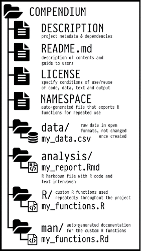

---
output:
  word_document: default
  pdf_document: default
  html_document: default
---

<!-- 
This file by Martin Monkman is licensed under a Creative Commons Attribution 4.0 International License. 
-->


# Data documentation {#datadocumentation}


In this chapter:


* Why we want to create documentation
  
* What elements to record
  
* Project information, including data dictionaries
  
* Code documentation through literate programming


## Introduction {#datadocumentation-intro}

The documentation of the data sources, methods, and workflow is vital for reproducibility\index{reproducibility}. There are two places where we need to embrace documentation: the first is within the code scripts, and the second is what we might consider the meta-information about our projects. 


"If you're not thinking about keeping track of things, you won't keep track of things." —Karl Broman


Documentation is also essential if you intend to share your data [@White_etal_nine_simple_ways]. The documentation we create provides metadata (which we will see more of in the data dictionary section below).


## Documentation and recordkeeping

The reasons for documenting our work are similar to the reasons we would save and output our cleaned data file: 

* To make the project available to a collaborator. 

* To provide a record for others who might use the data in the future. Your project might repeat a year or more in the future, after you have moved on to a new role. Leaving good documentation is good karma, or a "pay it forward in advance"—imagine how good that future user is going to feel when they find your clear explanations!

* To create a save point in our workflow, so that we can continue our work later but without having to go through all the steps to remember everything we've done.


As well, things change (the data, the software and hardware we use, the motivations for our work) and capturing the details about those things at the point we implement them helps us make any necessary changes that might be required at a later date.


There doesn't seem to be a single-best how-to instruction on "documentation" in the context of data analytics or data science. What advice exists tends to be prescriptive and at a high level, and not overly descriptive of what makes good documentation. The term appears in some of the textbooks and manuals on how to do data science, and there are some journal articles that address documentation in the context of reproducible research. In the blog post "Let's Get Intentional About Documentation," Randy Au presents the case that a better term might be "recordkeeping".

"Recordkeeping is keeping records, notes, and artifacts around to **help in creating documentation in the future.** It’s done by the people involved in doing the actual work saving things and making clarifications that only they really understand, with no expectation that someone else needs to understand everything. The material collected is primarily intended for use to write the actual documentation. Think of it as preserving raw data for future use." [@Au_documentation_2020b]

I like the way this is framed. In this view, "documentation" becomes a fully-realized user manual, suitable for complex and recurring projects with many different contributors, and that might be considered mission critical. A lot of data science work doesn't meet those criteria, so what is needed isn't "documentation" but the notes that someone could use to build the documentation.

If it's a one-off project, you can probably have minimal (but not zero!) recordkeeping. But a project that repeats on a regular schedule (whether daily, monthly, or annually) should have more robust recordkeeping, and potentially some documentation.

And it's important to think about this at the beginning of your work, perhaps even _before_ the beginning. Taking this approach, recordkeeping gets built into the process and your daily workflow, and becomes part of the work of data analysis. For example, you could record the source of your data as you're downloading it, or make comments about why you chose a particular function as soon as you incorporate the function into your script. These habits will not only capture what you're thinking at the time, but will also encourage you to think about the "why" of your decisions—and perhaps lead you to a different choice.


The idea of reproducibility\index{reproducibility} is a fundamental element of good scientific practice, and should be extended to include the analysis of the data. "The standard of reproducibility calls for the data and the computer code used to analyze the data be made available to others." [@Peng_reproducible_2011, p.1226] 

And while it's important in an academic environment, this necessity for reproducibility\index{reproducibility} extends to business and government settings as well. In any situation where the data analysis is supporting decisions, it is imperative that the analyst (i.e. you) be able to explain their methods, and quickly and effectively respond to changes in the data (you might receive an update to the data with more records or revisions to the existing records).


The benefits of a reproducible data science process\index{reproducibility} are summarized here: 

* Saves time,
* Produces better science,
* Creates more trusted research,
* Reduces the risk of errors, and
* Encourages collaboration. [@Smith_reproducible_2017]


All of the details involved with creating a reproducible workflow are outside the scope of this book; here we will concern ourselves with documentation.  


### Elements of effective recordkeeping

There are three things to capture in your recordkeeping:

1. The why and how of the decisions made.

1. How things work together. 

1. How to make changes.


\newpage
## Code documentation


"Document and comment your code for yourself as if you will need to understand it in 6 months." — attributed to Jenny Bryan


In the journal article "Good enough practices in scientific computing", the authors write "Good documentation is a key factor in software adoption, but in practice, people won't write comprehensive documentation until they have collaborators who will use it. They will, however, quickly see the point of a brief explanatory comment at the start of each script, so we have recommended that as a first step." [@Wilson_Bryan_good_enough_2017]


### Literate programming

Computer scientist Donald Knuth introduced the idea of "literate programming" in 1984. In this approach, a natural language explanation takes a central role, and the code chunks for each step follow that explanation. The idea is to "code your documentation," instead of "document your code."

Knuth wrote "Let us change our traditional attitude to the construction of programs: Instead of imagining that our main task is to instruct a computer what to do, let us concentrate rather on explaining to human beings what we want a computer to do."  [@Knuth_literate_programming_1992, p.99]

In the context of a data science project, this is enabled in R Markdown (or Jupyter notebooks), where text descriptions of the what and why of a code chunk can precede that chunk. So rather than existing as a separate "documentation" document, the record of the programmer's thoughts are captured in the file that runs the code.

These two quotes capture the key concepts of code documentation:

* "Document interfaces and reasons, not implementations." [@Wilson_etal_best_practices_2014]

* "Comments should explain the why, not the what." [@Wickham_AdvancedR_2015, p.68]
    

Using plain language in these notes also encourages you to think a second time about what you have just coded. Explaining the code to an imagined future reader (or your rubber duck) may help you to see a better way to write your code. 


### The instruction list

The instruction list is descriptive text that describes what chunks of code are doing.

In "How to Share Data for Collaboration," Ellis and Leek [@Ellis_Leek_2017] suggest something that is essential is a high-level outline of what the code is doing. Here's a rephrase of their first two steps:  

* Step 1: Take the raw data file, run summarize code with parameters _a_ = 1, _b_ = 2

* Step 2: Run the code separately for each sample 

To then apply Knuth's "Literate Programming" ideas, each step would then be followed by the code to carry out that step. The R Markdown format is ideal for this sort of work; the text description would be followed by a chunk of R code, followed by another text description/R chunk pair, and so on.


In practice, you may find yourself taking a step-by-step approach:

1. Create an outline of the basic plan,

2. Within that plan add the steps that you will take in your analysis,

3. Add some text detail for each step, 

4. Write the code.


### An example of documented code

What do these principles look like in practice? This example shows what each step might look like.

We start with the Outline:

* Objective: Find relative sizes of the 10 largest economies in the world.

* Data: The {gapminder} package will be used, using the most recent year of data (2007).

* Calculation: Per capita GDP * population = total country GDP. 

* Table: Create table with top 10 countries.

\newpage
_With that outline, we can proceed into the "Data" step_

```{r}
# DATA

gapminder_gdp <- gapminder::gapminder |> 
  # filter for most recent year
  # use `slice_max() function instead of hard-coding value 
  # - make sure that it is the most recent data
  # note: this is a shorthand for `filter(year == max(year))`
  slice_max(year)

```

_The "Calculation" step:_

```{r}
# CALCULATION

gapminder_gdp <- gapminder_gdp |> 
  # calculate total GDP
  mutate(gdpCountry = gdpPercap * pop) |> 
  # divide by 10^12 to turn into trillions
  mutate(gdpCountry = gdpCountry/(10^12)) |> 
  # select relevant variables
  select(country, gdpCountry) 

  
head(gapminder_gdp)

```

_Finally, creating the table and formatting it with the {gt} package [@R-gt]_

```{r}
gapminder_gdp |> 
  # use `slice_max()` with `n =` argument to get 10 largest economies
  # `slice_max()` has the added bonus of sorting in descending order
  slice_max(gdpCountry, n = 10) |> 
  # create table with {gt} package
  gt::gt() |>  
    # add table formatting 
    fmt_number() |> 
    # add table text
    tab_header(
      title = "Size of 10 largest national economies",
      subtitle = "Total GDP, 2007 (trillions of US$)"
    ) |> 
    tab_source_note(
    source_note = "Source: {gapminder} package"
    )
  # note: other table formatting to consider:
  # - change variable names
  # - add growth from 1957?

```


\newpage
> The first of Benjamin D. Lee's "Ten simple rules for documenting scientific
software" [@Lee_ten_simple_rules_2018] is "Write comments as you code."


## Project documentation


Part of the higher-level documentation is the structure of the files in your project.

For those working in an academic setting, Marwick, Boettiger, and Mullen [@Marwick_etal_2018] have defined three generic principles for what should be included in research compendia. These principles can also be adapted to other settings:

* Organize the files according to the prevailing standards. 

* Maintain a clear separation of data, method, and output.

* Specify the computational environment that was used.


This information is also referred to as a project's "metadata"  [@White_etal_nine_simple_ways]. 

A more detailed list of the things to capture in documentation includes:

* A brief description of the project, analysis, and research objective.

* A map of the file folder structure.


* Detailed information about the data source

  - Name of the organization that collected the data.
  
  - Name and contact information of the individual at that organization.
  
  - Date of download or extract.
  
  - Web links.
  
  - Original file names.
  
  - Links to additional documentation about the data, such as the data dictionary.

* A high-level statement about _how_ the analysis was done

  - For example: "This analysis used the daily data from 2010 through 2019 to calculate average per month volumes, which were then used in an ARIMA model to develop a 6 month forecast."


* Details about the analysis and code:
 
  - Things that informed decisions ("I chose this statistical test because..." or "The variable date of birth was transformed into 'Age on July 1, 2020' because...")
  
  - The instruction list—descriptive text that describes what files or chunks of code are doing, but not how they are doing it.

  - The data dictionary or code book.


* Details about the software and packages used:

  - Versions and (if available) release dates.


### README files


> Benjamin D. Lee's fourth rule in "Ten simple rules for documenting scientific software" [@Lee_ten_simple_rules_2018] is "Include a README file with basic information."


Having a README file in the root folder of your project is a good place to capture a great deal of the important general information about the project. And having another README in the data folder wouldn't hurt either.

Another source that describes a README for data files is the "Guide to writing "readme" style metadata" written by the Research Data Management Service Group at Cornell University. [@Research_Data_readme]

The SFBrigade, a San Francisco volunteer civic tech group, has created a data science specific README outline for their projects, hosted at github. ^[Project-README-template.md(https://github.com/sfbrigade/data-science-wg/blob/master/dswg_project_resources/Project-README-template.md)]

The basic minimum README structure recommended is:

* Project Intro/Objective

* Project Description

  - A missing component is "Data source". 

* Team (with contact information)

For an analytic project that has been completed, you might also want to include the high-level findings. This might be something akin to an abstract in an academic journal article or an executive summary in a business or government report.


Another source of tips is "Art of README" ^[["Art of README"](https://github.com/noffle/art-of-readme)]. Although it's aimed at people writing computer programs and modules, the lessons apply to data science projects as well. The purpose of a README is to:

1. Tell them what it is (with context).
1. Show them what it looks like in action.
1. Show them how they use it.
1. Tell them any other relevant details.


An example is the R package {palmerpenguins}\index{palmerpenguins} which has a comprehensive README on the github page.^[[{palmerpenguins} github page](https://github.com/allisonhorst/palmerpenguins/blob/master/README.md).]


### Capturing the directory structure

Your documentation (perhaps as part of the README file) can include a diagram that shows the directory structure. The package {fs} [@R-fs] has a function `dir_tree()` that will create a dendogram of the file folder structure and files in your project folder.

```{r, eval=FALSE}
library(fs)
```


The `recurse =` argument specifies how deep into the directory structure the diagram will be drawn. The default is to show all of the sub-folders and files below the current directory.

```{r dir_tree_true}

fs::dir_tree(path = "project_template")

```

Specifying `recurse = FALSE` limits what is shown to the files and sub-folders within the current directory. 


```{r dir_tree_false}
fs::dir_tree(path = "project_template", recurse = FALSE)
```

\newpage
It's also possible to specify how many layers, by using an integer rather than `FALSE` or `TRUE`.

```{r dir_tree_integer}

fs::dir_tree(path = "project_template", recurse = 2)

```


Marwick, Boettinger, and Mullen provide some concrete examples of a file structure might look like; note that the structure explicitly follows that of an R package. Their figure showing a "medium compendium" is below [@Marwick_etal_2018, p.84]:

{width=25%}


In this example, there are elements that might not be relevant for every project (for example, the licenses for the code and data). But note that there's a clear separation of the data and the code that generates the analysis. As well, this structure is well-supported by the "project" approach, where what is shown here as the "COMPENDIUM" folder would be the root folder of your project. Everything we need is self-contained within this single folder.


### The data dictionary or code book

As we will see, preparing data requires a number of steps, both objective and subjective, along the way. Creating a documentation of those decisions is essential. This documentation will serve as a record of the source of the data (all the better if you can also include specific information with the details of its collection such as dates, mode of collection, and the original survey questionnaire), the assumptions and decisions made in recoding and creating new variables, and so on.


Here are the three minimum components of a data dictionary:

1. Information about the variables (including units!) in the dataset not contained in the tidy data\index{tidy data},

1. Information about the summary choices made, and

1. Information about the experimental study design [or the data source]

[@Ellis_Leek_2017]


Caitlin Hudon's "Field Notes: Building Data Dictionaries" [@Hudon_data_dictionary_2018] provides some explicit guidelines as to what to include in a data dictionary, and poses "questions to answer with a data dictionary:"

1. What does the field mean? How should I use it?

2. What is the data supply chain?

  - Where does this data come from? How exactly is it collected? How often is it updated? Where does it go next?
  
3. What does the data in this field actually look like?

4. Are there any caveats to keep in mind when using this data?

5. Where can I go to get more information?


Finally, the {labelled} package [@R-labelled] contains the function `look_for()`, which generates a data dictionary of the dataframe that contains labelled variables\index{labelled variables}. ^[Joseph Larmarange, ["Generate a data dictionary and search for variables with look_for()"](http://larmarange.github.io/labelled/articles/look_for.html)]

Here, we read the SPSS\index{SPSS} version of the {palmerpenguins}\index{palmerpenguins} file, and then generate a data dictionary using the `look_for()` function. (We will return to using the {haven} package for reading data from SPSS, SAS, and Stata files later in this book.)

```{r}

penguins_sav <- haven::read_sav(dpjr::dpjr_data("penguins.sav"))

labelled::look_for(penguins_sav)

```


