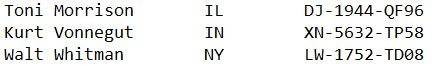

---
output:
  pdf_document: default
  html_document: default
---


```{r setup_ch200, include=FALSE, eval=TRUE}

source("package_load.R")

```


# Importing data {#importing}

In this chapter:

* Importing data from plain text files

* Importing data from spreadsheets


## Introduction

The data has been collected. It might be the result of:

* Running trials or experiments in a controlled laboratory setting.

* Making observations and recording the results of those observations (as an astronomer or biologist might).

* Sampling the people in an area and asking them a series of questions.

* Collecting information as part of a business operation. A familiar example are supermarket checkout scanners which collect data about grocery purchases. That data then facilitate operation management of the store by tracking sales and inventory, and generating orders.


Once the data has been collected in this way, you might have direct access to it. Or there may be a layer of processing between the raw source and the way it appears to your. After this processing, you might:

* Have access to a database where the raw data is stored, including where additional post-collection manipulation might happen.

* Be sent a file that contains a sample of the raw data.

* Be able to download data from a website, where the downloaded table has data that has already been compiled and summarized from a larger data set. An example would be a country's census data tables.


And it's important to note that your analysis project might require more than one of these methods of data collection.

How you assemble the data you need will depend on many factors, including what is already available, what your budget is (for example, some business-related data is collected by companies that then make it available at a cost), and the legal and regulatory environment (note that the definition of "personal information" varies from one jurisdiction to the next).


## Data formats

The data gets stored in a variety of electronic formats. The choice of format might be influenced by any one of the following:

* The underlying needs of the data collectors (some file formats are tailored to a specific use);

* The technology available to the collector;

* The nature of the data being collected.

There is sometimes (often?) no right answer as to the best format for a particular use case—there are pros and cons to each. (With that said, there is often a clear _less good_ choice for data storage and sharing...we're looking at you, PDF.) What this means is that in your workflow you will have to deal with data that needs to be extracted from a multitude of systems, and will be available to you in a multitude of formats.

> It is essential that a statistician can talk to the database specialist, and, as a team member, the statistician, along with most others, will be expected to be able to use the database facilities for most purposes by themselves, and of course advise on aspects of the design. There is always much preliminary 'data cleaning' to do before an analysis can begin, almost regardless of how good a job is done by the database specialist. [@Venables_IDT_review_2010]

There are plenty of resources detailing the complexities of the different data storage formats, and the decision process that goes into determining which format is appropriate for a specific use-case. I always approach the task assuming that the professionals who built the data storage system made a well-informed decision, including balancing the various trade-offs between different formats, as well as budgetary and technology constraints that they might have faced.


Reading: Chapter 5, "Data Storage" of [@Murrell_data_technologies] — [link](http://statmath.wu.ac.at/courses/data-analysis/itdtHTML/node51.html)


## Importing data


Here's some advice that's worth heeding:

1. The arguments in the import functions are your friends. Use them as your first line of defense in your project workflow.

> Data import generally feels one of two ways:

> * “Surprise me!” This is the attitude you must adopt when you first get a dataset. You are just happy to import without an error. You start to explore. You discover flaws in the data and/or the import. You address them. Lather, rinse, repeat.

 > * “Another day in paradise.” This is the attitude when you bring in a tidy dataset you have maniacally cleaned in one or more cleaning scripts. There should be no surprises. You should express your expectations about the data in formal assertions at the very start of these downstream scripts.

> In the second case, and as the first cases progresses, you actually know a lot about how the data is / should be. My main import advice: **use the arguments of your import function to get as far as you can, as fast as possible.** [Emphasis added.] Novice code often has a great deal of unnecessary post import fussing around. Read the docs for the import functions and take maximum advantage of the arguments to control the import.

[@Bryan_STAT545, [Chapter 9: Writing and reading files](https://stat545.com/import-export.html)]


2. "Today’s outputs are tomorrow’s inputs" [@Bryan_STAT545, [Chapter 9: Writing and reading files](https://stat545.com/import-export.html)]

> A plain text file that is readable by a human being in a text editor should be your default until you have **actual proof** that this will not work. Reading and writing to exotic or proprietary formats will be the first thing to break in the future or on a different computer. It also creates barriers for anyone who has a different toolkit than you do. Be software-agnostic. Aim for future-proof and moron-proof.


### Check your results

It's always a good idea to quickly check your data after any major processing step. This can start with, but is not limited to, importing your data.

Some things to ask about the data:

* Did the import step give you as many records (rows) as you expected?

* Are there as many variables (columns) as you expected?

* Are the variable types (or classes) for those variables what you anticipated?

  - Did variables that should be numbers load as numeric types, or as character?

  - If working with labelled variables, did they load as factor type?


We will look at structured ways investigate the contents of the data in the chapter [Validation strategies]{#validation}. For now, we will focus on the process of reading the contents of different types of files.


## Delimited plain text files

Plain-text (sometimes called "ASCII files", after the character encoding standard they use) files are often used to share data. They are limited in what they can contain, which has both downsides and upsides. On the downside, they can't carry any additional information with them, such as variable types and labels. But on the upside, they don't carry any additional information that requires additional interpretation by the software. This means they can be read consistently by a wide variety of software tools.

Plain text files come in two varieties: delimited and fixed-width. "Delimited" is a reference to the fact that the files have a character that marks the boundary between two variables. A very common delimited format is the CSV file; the letters in the file name stand for "Comma Separated Values", and use a comma as the variable delimiter. Another delimited type, somewhat less common, uses the tab character to separate the variables, and will have the extension "TSV" for, you guessed it, "Tab Separated Values". Occasionally you will find files that use semi-colons, colons, or spaces as the delimiters.


### using base R

Base R [@R-base] has a number of functions to read CSV, TSV, and fixed-width files.

For example, `read.csv()` is a base R function to read CSV files.


```{r}
# example
# assign path using the {here} package
penguins_path <- here::here("data", "penguins.csv")

# read the contents of the CSV file
penguins_data <- read.csv(penguins_path)
```


```{r penguins_csv, echo=FALSE, eval=FALSE}
# alternative approach with {dpjr} package
library(dpjr)
penguins_path <- dpjr_data("penguins.csv")

penguins_data <- read.csv(penguins_path)

```


### {readr} (tidyverse)

The {readr} [@R-readr] package is part of the tidyverse, and has some advantages over the base R functions when it comes to plain-text files.

This example is a modification of the example provided at the reference page for {readr} ^[{readr} reference page: https://readr.tidyverse.org/index.html]

We activate {readr} by using the `library()` function:

```{r, eval=FALSE}
library(readr)
```


This chunk creates a string object that contains the path name, and then uses the function `read_csv()` to create an object called `penguins_data`, from a CSV file of the same name.

* Note: this is `read` _underscore_ `csv`, not base R's `read` _dot_ `csv`.

The `read_csv()` function is quite a bit faster with big data files, and has some handy flexibility when it comes to defining variable types as part of the read function (rather than reading in the data, and then altering the variable types). As well, it returns a tibble instead of a data frame. (For information about the difference, see [@Wickham_Grolemund2016 10 Tibbles])

```{r}
# read the file and assign it to the object "penguins_data"
# note that this uses the "penguins_path" object created earlier
penguins_data <- read_csv(penguins_path)

```

The function returns a message letting us know the type that each variable is assigned.

Adding the `col_types = cols()` parameter allows us to alter what {readr} has decided for us. For example, we could set the `species` variable to be an factor.

When we show the entire table, we can see that the variable `species` is now an "<fctr>" type.

```{r}
penguins_data <- read_csv(penguins_path,
                   col_types =
                     cols(species = col_factor()))
penguins_data
```


The {readr} package allows a lot of control over how the file is read. Of particular utility are 

* `na = ""` -- specify which values you want to be turned into `NA`

* `skip = 0` -- specify how many rows to skip 

* `n_max = Inf` -- the maximum number of records to read


For example, if we were working with a very large file and wanted to read the first five rows, just to see what's there, we could write the following:

```{r}
read_csv(penguins_path, 
         n_max = 5)
```


## Fixed-width files

Fixed-width files don't use a delimiter, and instead specify which column(s) each variable occupies, consistently for every row in the entire file.

Fixed-width files are a hold-over from the days when storage was expensive and/or on punch cards. This meant that specific columns in the table (or card) were assigned to a particular variable, and precious space was not consumed with a delimiter. Compression methods have since meant that a CSV file with unfixed variable lengths are more common, but in some big data applications, fixed-width files can be much more efficient.

If you ever have to deal with a fixed-width file, you will (or should!) receive a companion file letting you know the locations of each variable in every row.

In this example, we will use the one provided in the {dpjr} package, `authors_fwf.txt`. This code chunk assigns the path to the file location, which we can use in our code later.


```{r importing_authors_path}
authors_path <- dpjr::dpjr_data("authors_fwf.txt")
```


This simple file has four (or as we will see, sometimes three, if we combine first and last name as one) variables, and three records (or rows).

* first name

* last name

* U.S. state of birth (two-letter abbreviation)

* randomly generated unique ID

If we open the file in a text editor, we see this:




The first approach would be to allow {readr} to guess where the column breaks are. The `fwf_empty()` function looks through the specified file and returns the beginning and ending locations it has guessed, as well as the `skip` value that the `read_fwf()` function uses.

Note that the column names are specified in a list. 


```{r importing_authors_path_2}
fwf_empty(authors_path, col_names = c("first", "last", "state", "unique_id"))
```

That information can then be used by the `read_fwf()` function:

```{r importing_authors_path_3}

read_fwf(authors_path, 
         fwf_empty(authors_path, 
                   col_names = c("first", "last", "state", "unique_id")))

```


Note that {readr} will impute the variable type, as it did with the CSV file. And although we won't implement it in these examples, in the same way `read_fwf()` allows us to use the `col_types` specification, as well as `na`, `skip`, and others. See the `read_fwf()` reference at https://readr.tidyverse.org/reference/read_fwf.html for all the details.


Reading this fixed-width file with these three author names worked, but it could break quite easily. We just need one person with a three or more components to their name (initials, spaces, or hyphens, as in [Ursula K. Le Guin](https://en.wikipedia.org/wiki/Ursula_K._Le_Guin) or [Ta-Nehisi Coates](https://en.wikipedia.org/wiki/Ta-Nehisi_Coates)), or some missing values, and the inconsistent structure throws off the `read_fwf()` parser.

In this example, we read a longer list of author names:

```{r importing_authors2_path_}
authors2_path <- dpjr::dpjr_data("authors2_fwf.txt")

fwf_empty(authors2_path, 
                   col_names = c("first", "last", "state", "unique_id"))

```

The `fwf_empty()` function found only three columns, as shown in the "begin" and "end" values that are returned.

When we use the read function, it finds three columns:

```{r}
read_fwf(dpjr::dpjr_data("authors2_fwf.txt"))
```


Adding the `col_names =` argument now mis-identifies the variables.

```{r}

read_fwf(authors2_path, 
         fwf_empty(authors2_path, 
                   col_names = c("first", "last", "state", "unique_id")))

```

A more reliable approach is to specify exactly the width of each column. Note that in the example below, we specify only "name" without splitting it into first and last.

The variables and their widths are as follows:


Variable           Width   Start position   End position
--------           -----   --------------   ------------
name               20       1               20
state              10       21              30
uniqueID           12       31              42


Visually, the file looks like this:


Those column positions can also be used to determine the width of each variable:


The widths can be added to the `fwf_widths` argument:

```{r}

read_fwf(authors2_path, 
         fwf_widths(c(20, 10, 12), c("name", "state", "unique_id")))

```

A third option is to provide two lists of locations using `fwf_positions()`, the first with the start positions, and the second with the end positions. The first variable "name" starts at position 1 and ends at position 20, and the second variable "ssn" starts at 30 and ends at 42. Note that we won't read the "state" variable which occupies the ten columns from 21 through 29.

```{r}
read_fwf(authors2_path, 
         fwf_positions(c(1, 31), c(20, 42), c("name", "unique_id")))
```

The fourth is a syntactic variation on the third, with the same values but in a different order. This time, all of the relevant information about each variable is aggregated, with the name followed by the start and end locations.

```{r}

read_fwf(authors2_path, 
         fwf_cols(name = c(1, 20), unique_id = c(31, 42)))

```

And finally, {readr} provides a fifth way to read in a fixed-width file that is a variation on the second approach we saw, with the name and the width values aggregated.

```{r}

read_fwf(authors2_path, 
         fwf_cols(name = 20, state = 10, unique_id = 12))

```


### {vroom} - another package for plain text

https://www.tidyverse.org/blog/2019/05/vroom-1-0-0/

https://vroom.r-lib.org/


### An extreme example of a fixed-width file 

A particularly interesting research question is the relationship between education level and different health outcomes. In this example, we will start the process of importing a large file that contains data that will allow us to explore whether there is a correlation.  

Statistics Canada has made available a Public-Use Microdata File (PUMF) of the Joint Canada/United States Survey of Health (JCUSH)\index{Joint Canada/United States Survey of Health (JCUSH)}, a telephone survey conducted in late 2002 and early 2003. There were 8,688 respondents to the survey, 3,505 Canadians and 5,183 Americans. The data file that is available is anonymized, so we have access to the individual responses, which will facilitate additional analysis.

The webpage for the survey, including the PUMF file, data dictionary, and methodological notes, is here:
https://www150.statcan.gc.ca/n1/pub/82m0022x/2003001/4069119-eng.htm

The PUMF is a fixed-width file named "JCUSH.txt". This file is quite a lot larger than the author names example above. There are the 8,688 records and each line of data takes up 552 columns! 

Here's what the first record looks like:


```{r jcush_txt_readlines}
readLines(dpjr::dpjr_data("JCUSH.txt"), n = 1)
```

There's not a bit of white space anywhere in this data file!

Here's how one variable, highest level of post-secondary education achieved, appears in the data dictionary:


The variable is 1 character long, in position 502 of the data.

The variable might be only 1 character long, but when coupled with the "content" column, it becomes a very powerful piece of information. 

For our analysis question, we will read in three variables: the country, the overall health outcomes, and education level. For the variable names, we will use the same ones used in the data dictionary:

| Name | Variable | Length | Position |
| :--- | :---     | :---:  | :---:  |
| SAMPLEID | Household identifier | 12 | 1 - 12 |
| SPJ1_TYP | Sample type [country] | 1 | 13 |
| GHJ1DHDI | Health Description Index | 1 | 32 |
| SDJ1GHED | Highest level of post-secondary education attained | 1 | 32 |


You will note in the code below that in the case of the variables that are of length "1", the code the start and end positions are the same.

As well, the `SAMPLEID` variable is a 12-digit number; the `read_fwf()` will interpret this as variable type double, and represent it in scientific notation. To be useful, we want to be able to see and evaluate the entire string. As a result, we use `col_types()` to specify `SAMPLEID` as a character.

```{r jcush_txt_read_vars}

jcush <- readr::read_fwf(dpjr::dpjr_data("JCUSH.txt"), 
         fwf_cols(
           SAMPLEID = c(1, 12),
           SPJ1_TYP = c(13, 13), 
           GHJ1DHDI = c(32, 32),
           SDJ1GHED = c(502, 502)
           ),
         col_types = list(
           SAMPLEID = col_character()
         ))

head(jcush)

```

Imagine, though, the challenge of handling this amount of data at one time! Between the many variables and the complex value labels, the "data" is more than just the fixed-width file. This is a circumstance where a different data storage solution ([as we will see later](#700_labelled_factors)) might have some strengths.


## Spreadsheets

Spreadsheets and similar data tables are perhaps the most common way that data is made available. Because they originated as an electronic version of accounting worksheets, they have a tabular structure that works for other situations when data collection, storage, analysis, and sharing (i.e. publishing) are required. Spreadsheet software of one form or another is often standard when you buy a new computer, and Microsoft Excel is the most common of all. And Google makes available a web-based spreadsheet tool, Google Sheets.

Broman and Woo [@Broman_Woo_2017] provide a how-to for good data storage practice in a spreadsheet, but you are much more likely to find yourself working with a spreadsheet that doesn't achieve that standard. Spreadsheets have a dark side (at least when it comes to data storage)—the values you see are not necessarily what's in the cell. For example, a cell might be the result of an arithmetic function that brings one or more values from elsewhere in the sheet (or in some cases, from another sheet). Some users will colour-code cells, but with no index to tell you what each colour means. [@Bryan_spreadsheets_2016] (For an alternative vision, see "Sanesheets" [@Bryan_sanesheets_2016].)

Paul Murrell titled his article "Data Intended for Human Consumption, Not Machine Consumption" [@Murrell_consumption] for a reason: all too often, a spreadsheet is used to make data easy for you and I to read, but this makes it harder for us to get it into a structure where our software program can do further analysis. But as his article, and the others cited earlier make plain, it's possible to achieve both goals.


### Excel files

If anything, Excel files (with either the .XLS or .XLSX extensions) are more common than CSV and other plain-text data files. They seem to multiply like coat hangers in the closet.

And as we see in the article by Karl Broman & Kara Woo, ["Data Organization in Spreadsheets"] [@Broman_Woo_2017], Excel files can encourage some ways of storing information that makes it hard for us to analyze. Excel files can also contain a wide variety of data format types. 

The {readxl} package [@R-readxl] is designed to solve many of the challenges reading Excel files. {readxl} tries to figure out what's going on with each variable, but like {readr} it allows you to override some of those automated decisions.

```{r}
library(readxl)
```

In this example, we will read the contents of one sheet in an Excel file published by the UK Office of National Statistics. The file has the population by local authorities (regions), and includes one sheet with the population by sex, and another that has population by five-year age groups.

```{r}
uk_census_pop <- readxl::read_excel(
  "data/census2021firstresultsenglandwales1.xlsx",
  sheet = "P01",
  skip = 6, n_max = 10
)

uk_census_pop

```

A second option would be define the range of the cells, using Excel nomenclature.

```{r}
uk_census_pop <- readxl::read_excel(
  "data/census2021firstresultsenglandwales1.xlsx",
  sheet = "P01",
  range = "A7:E382"
)

uk_census_pop

```


## File archives

There are a variety of file archive types, which permit multiple files to be bundled as a single file. Many of these types also include compression, so that the file size is minimized. These file types include ZIP, tar, 7-Zip, RAR, gzip, bzip2, XZ and Zstandard.

The {archive} package [@R-archive] allows us to write R code to work with these files. There are functions for extracting from and writing to archive file types.

{archive} https://www.tidyverse.org/blog/2021/11/archive-1-1-2/


***

## Additional resources


Other examples of importing files can be found here:

* Long and Teetor, _R Cookbook, 2nd ed._ [@Long_Teetor_2019, recipe 4.6] https://rc2e.com/inputandoutput#recipe-id136

* Wickham and Grolemund, _R for Data Science_ [@Wickham_Grolemund2016, Chapter 11 Data Import] https://r4ds.had.co.nz/data-import.html

* Zumel and Mount, _Practical Data Science with R_ [@Zumel_Mount_2019, chapter 2]


<!-- 
This file by Martin Monkman is licensed under a Creative Commons Attribution 4.0 International License. 
-->

