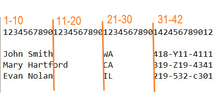

---
output:
  pdf_document: default
  html_document: default
---

```{r setup_ch200, include=FALSE}

# packages
# tidyverse (extended)
library(tidyverse)
library(haven)

# utilities
library(here)
library(janitor)
library(labelled)

```


# Importing data {#importing}

The data has been collected. It might be the result of:

* Running trials or experiments in a controlled laboratory setting.

* Making observations and recording the results of those observations (for example, as an astronomer or biologist might).

* Sampling the people in an area and asking them a series of questions.

* Collecting information as part of a business operation. A familiar example are supermarket checkout scanners which data about grocery purchases, which facilitate operation management of the store by tracking sales and inventory, and generating orders.


Once it has been collected in this way, you might have direct access to it. Or it may have a layer of processing between the raw source and the way it appears to your. After this processing, you might:

* Have access to a database where the raw data with additional manipulations is stored.

* Have access to a sample of the raw data.

* Download data from a website, where the downloaded table has data that has already been compiled and summarized from a larger data set. An example would be Statistics Canada's Census data tables.


And it's important to note that your analysis project might require more than one of these methods of data collection.

How you assemble the data you need will depend on many factors, including what is already available, what your budget is (for example, some business-related data is collected by companies that then make it available at a cost), and the legal and regulatory environment (for example, the definition of "personal information" varies from one jurisdiction to the next).


## Data formats

The data gets stored in a variety of electronic formats. The choice of format might be influenced by any one of the following:

* the underlying needs of the data collectors (some file formats are tailored to a specific use);

* the technology available to the collector;

* the nature of the data being collected.

There is sometimes (often?) no right answer as to the best format for a particular use case—there are pros and cons to each. (With that said, there is often a clear _less good_ choice for data storage and sharing...we're looking at you, PDF.) What this means is that in your workflow you will have to deal with data that needs to be extracted from a multitude of systems, and will be available to you in a multitude of formats.

> It is essential that a statistician can talk to the database specialist, and, as a team member, the statistician, along with most others, will be expected to be able to use the database facilities for most purposes by themselves, and of course advise on aspects of the design. There is always much preliminary 'data cleaning' to do before an analysis can begin, almost regardless of how good a job is done by the database specialist. [@Venables_IDT_review_2010]

There are plenty of resources detailing the complexities of the different data storage formats, and the decision process that goes into deciding which format is appropriate for a specific use-case. I always approach the task assuming that the professionals who built the data storage system made a well-informed decision, including balancing the various trade-offs between different formats, as well as budgetary and technology contraints that they might have faced.


Reading: Chapter 5, "Data Storage" of [@Murrell_data_technologies] — [link](http://statmath.wu.ac.at/courses/data-analysis/itdtHTML/node51.html)


## Importing data

"Enough with the chatter...let's get to it!"

Wait a minute.

Here's some advice that's worth heeding:

1. The arguments in the import functions are your friends! Use them as your first line of defense in your project workflow.

> Data import generally feels one of two ways:
* “Surprise me!” This is the attitude you must adopt when you first get a dataset. You are just happy to import without an error. You start to explore. You discover flaws in the data and/or the import. You address them. Lather, rinse, repeat.
* “Another day in paradise.” This is the attitude when you bring in a tidy dataset you have maniacally cleaned in one or more cleaning scripts. There should be no surprises. You should express your expectations about the data in formal assertions at the very start of these downstream scripts.
In the second case, and as the first cases progresses, you actually know a lot about how the data is / should be. My main import advice: use the arguments of your import function to get as far as you can, as fast as possible. Novice code often has a great deal of unnecessary post import fussing around. Read the docs for the import functions and take maximum advantage of the arguments to control the import.

[@Bryan_STAT545, [Chapter 9: Writing and reading files](https://stat545.com/import-export.html)]


2. "Today’s outputs are tomorrow’s inputs" [@Bryan_STAT545, [Chapter 9: Writing and reading files](https://stat545.com/import-export.html)]

> A plain text file that is readable by a human being in a text editor should be your default until you have **actual proof** that this will not work. Reading and writing to exotic or proprietary formats will be the first thing to break in the future or on a different computer. It also creates barriers for anyone who has a different toolkit than you do. Be software-agnostic. Aim for future-proof and moron-proof.


general R advice on import/export:  https://cran.r-project.org/doc/manuals/r-devel/R-data.html


## Delimited plain text files

Plain-text (sometimes called "ASCII files", after the character encoding standard they use) files are often used to share data.  They are limited in what they can contain, which has both upsides and downsides. On the downside, they can't carry any additional information with them, such as variable types and labels. But on the upside, they don't carry any additional information that requires additional interpretation by the software. This means they can be read consistently by a wide variety of software tools.

They come in two varieties, delimited and fixed-width. "Delimited" is a reference to the fact that the files have a character that marks the boundary between two variables. A very common format is the CSV file; the letters in the file name stand for "Comma Separated Values". Another delimited type, although less common, uses the tab character to separate the variables, and will have the extension "TSV" for, you guessed it, "Tab Separated Values". Occasionally you will find files that use semi-colons, colons, or spaces as the delimiters.


### using base R

Base R has a number of functions to read CSV, TSV, and fixed-width files.

{base} [@R-base]

For example, `read.csv()` is a base R function to read CSV files.

```{r}
# example
# assign path using the {here} package
mtcars_path <- here::here("data", "mtcars.csv")

mtcars <- read.csv(mtcars_path)

```


### {readr} (tidyverse)

The {readr} [@R-readr] package is part of the tidyverse, and works very well to read plain-text files. (This example comes straight from the reference page for {readr} ^[{readr} reference page: https://readr.tidyverse.org/index.html])

We activate {readr} by using the `library()` function:

```{r}
library(readr)
```


This chunk creates a string object that contains the path name, and then uses the function `read_csv()` * to create an object called `mtcars`, from a CSV file of the same name.

* Note: this is `read` _underscore_ `csv`, not base R's `read` _dot_ `csv`.

`read_csv()` is quite a bit faster with big data files, has some handy flexibility when it comes to defining variable types as part of the read function (rather than reading in the data, and then altering the variable types), returns a tibble instead of a data frame. (For information about the difference, see [_R for Data Science_, 10 Tibbles](https://r4ds.had.co.nz/tibbles.html) [@Wickham_Grolemund2016])

```{r}
# read the file and assign it to the object "mtcars"
mtcars <- read_csv(mtcars_path)

```

The function has the message shown above, letting us know the variable type that each is assigned.

Adding the `col_types = cols()` parameter allows us to alter what {readr} has decided for us. For example, we could set the `cyl` variable to be an integer.

When we show the entire table, we can see that the variable `cyl` is now an "<int>" type.

```{r}
mtcars <- read_csv(mtcars_path,
                   col_types =
                     cols(cyl = col_integer()))
mtcars
```


The {readr} package allows a lot of control over how the file is read. Of particular utility are 

* `na = ""` -- specify which values you want to be turned into `NA`

* `skip = 0` -- specify how many rows to skip 

* `n_max = Inf` -- the maximum number of records to read


For example, if we were working with a very large file and wanted to read the first five rows, just to see what's there, we could write the following:

```{r}
read_csv(mtcars_path, 
         n_max = 5)
```


## Fixed-width files

Fixed-width files don't use a delimiter, and instead specify which column(s) each variable occupies, consistently for every row in the entire file.

Fixed-width files are a hold-over from the days when storage was expensive and/or on punch cards. This meant that specific columns in the table (or card) were assigned to a particular variable, and precious space was not consumed with a delimiter. Compression methods have since meant that a CSV file with unfixed variable lengths are more common, but in some big data applications, fixed-width files can be much more efficient.

If you ever have to deal with a fixed-width file, you will (or should!) receive a companion file letting you know the locations of each variable in every row.

In this example, we will use the one provided in the {readr} package, `fwf-sample.txt`. This simple file has four (or as we will see, sometimes three, if we combine first and last name as one) variables, and three records (or rows).

If we open the file in a text editor, we see this:


Note that the column names are specified in a list. 

The first approach would be to allow {readr} to guess where the column breaks are. The `fwf_empty()` function looks through the specified file and returns the beginning and ending locations it has guessed, as well as the `skip` value that the `read_fwf()` function uses.

```{r}
fwf_sample <- here::here("data", "fwf-sample.txt")

fwf_empty(fwf_sample, col_names = c("first", "last", "state", "ssn"))
```

That information can then be used by the `read_fwf()` function:

```{r}

read_fwf(fwf_sample, 
         fwf_empty(fwf_sample, 
                   col_names = c("first", "last", "state", "ssn")))

```


Note that {readr} will impute the variable type, as it did with the CSV file. And although we won't implement it in these examples, in the same way we can use the `col_types` specification, as well as `na`, `skip`, and others. See the `read_fwf` reference at https://readr.tidyverse.org/reference/read_fwf.html for all the details.


So that worked, but it could break quite easily. We just need one person with a three or more components to their name (initials, spaces, or hyphens, as in [Ursula K. Le Guin](https://en.wikipedia.org/wiki/Ursula_K._Le_Guin) or [Ta-Nehisi Coates](https://en.wikipedia.org/wiki/Ta-Nehisi_Coates)), or some missing values, and the inconsistent structure throws off the parser.

```{r}

fwf_sample2 <- here::here("data", "fwf-sample2.txt")

read_fwf(fwf_sample2, 
         fwf_empty(fwf_sample2, 
                   col_names = c("first", "last", "state", "ssn")))

```

A more reliable approach is to specify exactly the width of each column. Note that in the example below, we specify only "name" without splitting it into first and last.

The variables and their widths are as follows:


Variable           Width   Start position   End position
--------           -----   --------------   ------------
name               20       1               20
state              10       21              30
ssn                12       31              42


Visually, the file looks like this (the digits across the top represent the column position):





Those column positions can also be used to determine the width of each variable:


The widths can be added to the `fwf_widths` argument:

```{r}

read_fwf(fwf_sample2, 
         fwf_widths(c(20, 10, 12), c("name", "state", "ssn")))

```

A third option is to provide two lists of locations using `fwf_positions()`, the first with the start positions, and the second with the end positions. The first variable "name" starts at position 1 and ends at position 20, and the second variable "ssn" starts at 30 and ends at 42. Note that we won't read the "state" variable which occupies the ten columns from 21 through 29.

```{r}
read_fwf(fwf_sample2, 
         fwf_positions(c(1, 31), c(20, 42), c("name", "ssn")))
```

The fourth is a syntactic variation on the third, with the same values but in a different order. This time, all of the relevant information about each variable is aggregated, with the name followed by the start and end locations.

```{r}

read_fwf(fwf_sample2, 
         fwf_cols(name = c(1, 20), ssn = c(31, 42)))

```

And finally, {readr} provides a fifth way to read in a fixed-width file that is a variation on the second approach we saw, with the name and the width values aggregated.

```{r}

read_fwf(fwf_sample2, 
         fwf_cols(name = 20, state = 10, ssn = 12))

```


### An extreme example of a fixed-width file

Statistics Canada has made available a Public-Use Microdata File (PUMF) of the Joint Canada/United States Survey of Health, a telephone survey conducted in late 2002 and early 2003. There were 8,688 respondents to the survey, 3,505 Canadians and 5,183 Americans. The data file that's available is anonymized, so we have access to the individual responses, which will facilitate additional analysis.

The webpage for the survey, including the PUMF file, data dictionary, and methodological notes, is here:
https://www150.statcan.gc.ca/n1/pub/82m0022x/2003001/4069119-eng.htm

The PUMF is a fixed-width file. Compared to the names example above, this is _huge_. There are the 8,688 records to start with. But the data takes up 552 columns! 

Here's what the first two-and-a-bit records look like:


You can spot the end of each record, as the partial line. There's not a bit of white space anywhere in this data file!

Here's how one variable, highest level of post-secondary education achieved, appears in the data dictionary:


The variable is 1 character long, in postion 502 of the data.

The researchers might look at the relationship between education level and different health outcomes, so this variable would be a important one. The variable is only 1 character long, but when coupled with the "content" column, it becomes a very powerful piece of information. 

Imagine, though, the challenge of handling this amount of data at one time! Between the many variables and the complex value labels, the "data" is more than just the fixed-width file. This is a circumstance where a different data storage solution (as we will see later) might have some strengths.


## Spreadsheets

Spreadsheets and similar data tables are perhaps the most common way that data is made available. Because they originated as an electronic version of accounting worksheets, they have a tabular structure that works for other applications data storage, analysis, and sharing (i.e. publishing). Spreadsheet of one from or another is often standard when you buy a new computer, and Microsoft Excel is the most common of all. And Google makes available a web-based spreadsheet tool, Google Sheets.

Broman and Woo [@Broman_Woo_2017] provide a how-to for good data storage practice in a spreadsheet,but you are much more likely to find yourself working with a spreadsheet that doesn't achieve that standard. Spreadsheets have a dark side (at least when it comes to data storage)—the values you see are not necessarily what's in the cell. For example, a cell might be the result of an arithmetic function that brings one or more values from elsewhere in the sheet (or in some cases, from another sheet). Some users will colour-code cells, but with no index to tell you what each colour means. [@Bryan_spreadsheets_2016] (For an alternative vision, see "Sanesheets" [@Bryan_sanesheets_2016].)

Paul Murrell titled his article "Data Intended for Human Consumption, Not Machine Consumption" [@Murrell_consumption] for a reason: all too often, a spreadsheet is used to make data easy for you and I to read, but this makes it harder for us to get it into a structure where our software program can do further analysis.


### Excel files

If anything, Excel files (with the .XLS or .XLSX extensions) are more common than CSV and other plain-text data files. They seem to multiply like coat hangers in the closet...

And as we see in the article by Karl Broman & Kara Woo, ["Data Organization in Spreadsheets"](https://www.tandfonline.com/doi/full/10.1080/00031305.2017.1375989), Excel files can encourage some ways of storing information that makes it hard for us to analyze. Excel files can also contain a wide variety of data format types. 

The {readxl} package [@R-readxl] is designed to solve many of the challenges reading Excel files. {readxl} tries to figure out what's going on, but like {readr}, it allows you to override some of those automatic decisions.

```{r}
library(readxl)
```


```{r}
deaths_file_path <- here("data", "deaths.xlsx")

deaths <- read_excel(deaths_file_path)
deaths
```

What do you notice about the "Date of birth" and "Date of death" columns?


Read in the "deaths" file, but use the `range = ` option to specify when to start reading the file:


```{r}
# Example
deaths <- read_excel(deaths_file_path, 
                     range = "A1:B3")

deaths

# solution
deaths <- read_excel(
  deaths_file_path,
  range = "A5:F15"
)

deaths

```


Use the `skip =` and `n_max =` options to achieve the same thing:

```{r}
deaths <- read_excel(deaths_file_path,
                     skip = 4,
                     n_max = 10)

deaths
```


## Statistical software


If you work with statisticians, economists, sociologists, survey practioners, and many others, you will find yourself encountering data files created using the software packages SAS, SPSS, and Stata. They have been around a long time (SAS and SPSS trace their history back to the late 1960s, and Stata was created in 1985) and have evolved, demonstrating their robustness, and have become common in many academic, corporate, and government settings. 

A feature of these programs is that the variables and the associated values can be _labelled_. If you're familiar with **R**, value labelling is conceptually similar to the use of factor labels. These labels can carry a great deal of detail to which you might otherwise not have easy access.

The **R** package {haven} [@R-haven] provides the functionality to read these three types of files; the reference page for {haven} is here: https://haven.tidyverse.org/index.html

`library(haven)`


For most of these examples, we will work with SPSS formatted files; the approach is similar for the other two formats, and only differs in the details. For example, the `read_()` functions vary only with the extension. For example, a Stata data file has the extension ".dta", so the read function is `read_dta()`:


```{r}

haven::read_dta(here("data", "iris.dta"))

```

The equivalent for a SAS file is as follows:


```{r}

haven::read_sas(here("data", "iris.sas7bdat"))

```

Here's the code to read that same data file in SPSS's ".sav" format:

```{r}

haven::read_sav(here("data", "iris.sav"))

```


### Reading an SPSS file: "Video"

The file used in this example comes from the University of Sheffield Mathematics and Statistics Help's "Datasets for Teaching"
https://www.sheffield.ac.uk/mash/statistics/datasets

> This dataset was collected by Scott Smith (University of Sheffield) to evaluate the use of best method for informing the public about a certain medical condition. There were three videos (New general video A, new medical profession video B, the old video C and a demonstration using props D). He wanted to see if the new methods were more popular so collected data using mostly Likert style questions about a range of things such as understanding and general impressions. This reduced dataset contains some of those questions and 4 scale scores created from summing 5 ordinal questions to give a scale score.

If you were working in SPSS, when you open the file, you would see the data like this:


SPSS also gives you the option to view the variables:


In this view, we can see both the variable names and the variable labels (in this case, the precise wording of the survey question).


And we can also drill deeper, and see the value labels:


The R package {haven} allows us to capture all of this information.


#### Read SPSS data into R

For the first step, we will read in the data with the default parameters.

```{r}

df_video <- read_spss(here("data", "Video_SPSS.sav"))

# display the data in the console
df_video

```

Note that in the variable descriptions, it includes `<S3: haven_labelled>` for those that bring the SPSS labels with them.

But some of the variable names have leading `@` (at sign)...they will cause us some headaches later, so let's use the `clean_names()` function from the {janitor} package to clean them up.

* the reference page for {janitor} is here: http://sfirke.github.io/janitor/

```{r}

df_video <- janitor::clean_names(df_video)

df_video

```


#### Handling missing values 

Very often, SPSS files will have "user defined missing values". As we see above, they have been coded as "NA". But often, the analysis of survey results will have multiple types of "missing values":

* respondent left the question blank

* respondent didn't answer the question because of skip logic

* the analyst may have decided to code "Don't know" or "Not applicable" as "missing" when calculating the percentages of responses in the other categories.

Depending on the circumstance, you may want to count some of these. For example, if there a lot of "Don't know" and "Not applicable" responses, you may wish to analyze which one it is (they mean very different things!) If the are all coded as 
"NA", you have lost that ability.

In the code below, adding the `user_na = TRUE` maintains the original values.

```{r}
df_video <- read_spss(here("data", "Video_SPSS.sav"), user_na = TRUE)

df_video <- janitor::clean_names(df_video)

df_video

```

What were "NA" in the first version are now "0".


#### Exploring the data

The `attributes()` function gives us a way to view the details of the variables.

First, we can look at the attributes of the whole dataframe.

```{r}

attributes(df_video)

```

Or we can look at the attributes of a single variable; in this case, `heardofcondition`

```{r}

attributes(df_video$heardofcondition)

```

The `$label` is the question, and the `$labels` are the labels associated with each value, including N/A. Note that there's also a `$na_values` shown.

You can also string these together; for example, if we want to see the value labels and nothing else, the code would be as follows:


```{r}

attributes(df_video$heardofcondition)$labels

```


### Factors

Factors behave differently than labels: they don't preserve both the label and the value. Instead they display the value and preserve the sort order (that can be either automatically set, or defined in the code).

In the code below, we will set all of the variables in the `df_video` dataframe as factors, first without any additional parameters, and then with the `levels` parameter set to `both`.

```{r}

(df_video_factor <- as_factor(df_video))

```


```{r}

(df_video_both <- as_factor(df_video, levels="both"))

```


### {labelled} -

The package {labelled} gives us a range of powerful tools for working with the variable labels, value labels and defined missing values in an SPSS (or SAS or Stata) dataframe.

The package's reference page is here: http://larmarange.github.io/labelled/index.html

As well, there is a good introduction to the functions in the package here: http://larmarange.github.io/labelled/articles/intro_labelled.html


One of the most useful functions is `look_for()`, which provides a data dictionary of the dataframe.


For more about {labelled}, see 

* http://larmarange.github.io/labelled/

* https://cran.r-project.org/web/packages/labelled/


***

## Additional resources

Other examples of importing files can be found here:

* Long and Teetor, _R Cookbook, 2nd ed._ [@Long_Teetor_2019, recipe 4.6] https://rc2e.com/inputandoutput#recipe-id136

* Wickham and Grolemund, _R for Data Science_ [@Wickham_Grolemund2016, Chapter 11 Data Import] https://r4ds.had.co.nz/data-import.html

* Zumel and Mount, _Practical Data Science with R_ [@Zumel_Mount_2019, chapter 2]


<!-- 
This file by Martin Monkman is licensed under a Creative Commons Attribution 4.0 International License. 
-->

