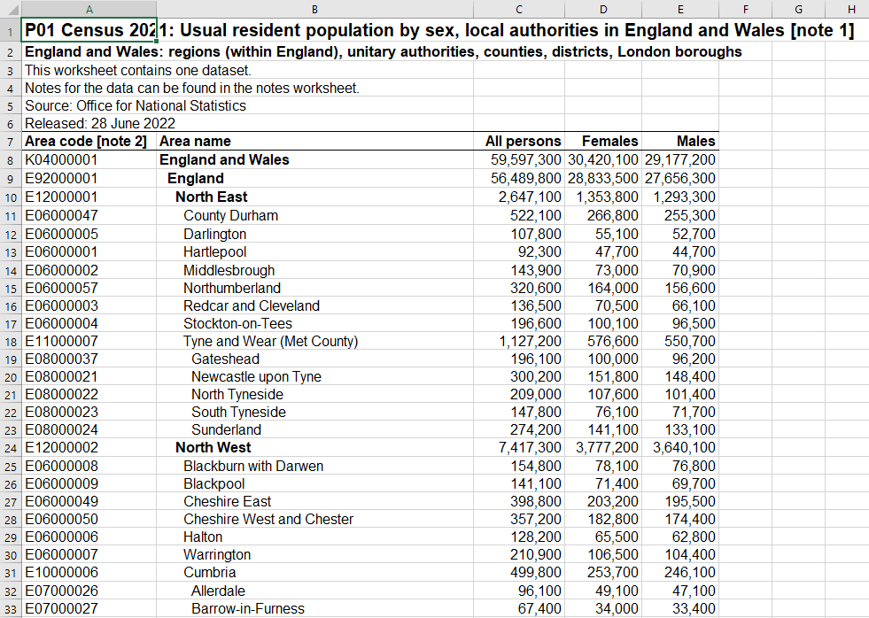

---
output:
  pdf_document: default
  html_document: default
---


```{r setup_ch225, include=FALSE, eval=TRUE}

#source("package_load.R")

```


# Importing data from Excel {#Excel}

In this chapter:

* Importing data from Excel \index{Excel} spreadsheets

* Extracting data that is encoded as formatting


## Introduction

Spreadsheets and similar data tables are perhaps the most common way that data is made available. Because they originated as an electronic version of accounting worksheets, they have a tabular structure that works for other situations when data collection, storage, analysis, and sharing (i.e. publishing) are required. Spreadsheet software of one form or another is often standard when you buy a new computer, and Microsoft Excel is the most common of all. Google also makes available a web-based spreadsheet tool, Google Sheets that works in much the same way.

While the data in a spreadsheet often gets stored in a manner similar to a plain-text file such as the CSV files we worked with in the previous chapter, Excel is designed to deliver far more functionality. 

Broman and Woo [@Broman_Woo_2017] provide a how-to for good data storage practice in a spreadsheet, but you are much more likely to find yourself working with a spreadsheet that doesn't achieve that standard. Paul Murrell titled his article "Data Intended for Human Consumption, Not Machine Consumption" [@Murrell_consumption] for a reason: all too often, a spreadsheet is used to make data easy for you and I to read, but this makes it harder for us to get it into a structure where our software program can do further analysis. 

Spreadsheets like Excel also have a dark side (at least when it comes to data storage)—the values you see are not necessarily what's in the cell. For example, a cell might be the result of an arithmetic function that brings one or more values from elsewhere in the sheet (or in some cases, from another sheet, or anther sheet in another file). Some users will colour-code cells, but with no index to tell you what each colour means. [@Bryan_spreadsheets_2016] (For an alternative vision, see "Sanesheets" [@Bryan_sanesheets_2016].)

The "format as data" and "formatting as information" approaches of storing information can make it hard for us to undertake our analysis. Excel files can also contain a wide variety of data format types. 

The {readxl} package [@R-readxl] is designed to solve many of the challenges reading Excel files. {readxl} tries to figure out what's going on with each variable, but like {readr} it allows you to override some of those automated decisions.

```{r}
library(readxl)
```

In this example, we will read the contents of one sheet in an Excel file published by the UK Office of National Statistics, drawn from the 2021 Census of England and Wales. The file has the population by local authorities (regions), and includes sheets with notes about the data, and data tables containing the population by sex and five-year age groups, along with population density and number of households.

Our focus is on sheet "P01", with population by sex. The first few rows of the data look like this:




The {readxl} package's `read_excel()` function is the one we want to use. The first item is the path to the file. The function's default is to read the first sheet in the Excel file, which is not what we want, so we use the `sheet = ` argument to specify "P01". We will also read only the first 10 rows in the sheet, using the `n_max = 10` specification.

```{r}
uk_census_pop <- readxl::read_excel(
  dpjr::dpjr_data("census2021firstresultsenglandwales1.xlsx"),
  sheet = "P01",
  n_max = 10
)

uk_census_pop

```

As is common in Excel files, the first few rows at the top of the spreadsheet contain the title (now in the variable name row), along with things like the source and the release date. This is important documentation, but it's not part of the data we want for our analysis. The creators of Excel files also put note in the "margins" of the data (often to the right or below the data), much as you might see on a printed page.

The `read_excel()` function has a variety of approaches to specify the rectangular geometry that contains our data. One is `skip =`, which tells the function to skip the first 6 rows.


```{r}
uk_census_pop <- readxl::read_excel(
  dpjr::dpjr_data("census2021firstresultsenglandwales1.xlsx"),
  sheet = "P01",
  n_max = 10,
  skip = 6 
)

uk_census_pop

```

A second option would be define the range of the cells, using Excel nomenclature to the define the upper-left and bottom-right of the data rectangle. This is often a good approach when there is content outside the boundary of the data rectangle, such as additional notes. 

**Important note: there is no shame in opening the file in Excel to make a visual scan of the file, looking for those anomalous values and to note the corners of the data rectangle.**

In this code, we will also apply the `clean_names()` function from the {janitor} package [@R-janitor], which cleans the variable names. Specifically, it removes the spaces (and any other problematic characters), and puts the variable names into lower case. Finally, the `rename()` function is applied to remove the "_note_2" text from the area code variable.

```{r}
uk_census_pop <- readxl::read_excel(
  dpjr::dpjr_data("census2021firstresultsenglandwales1.xlsx"),
  sheet = "P01",
  range = "A7:E382"
) |> 
  janitor::clean_names() |> 
  rename(area_code_note_2 = area_code)

uk_census_pop

```


The data has been read correctly, including the fact that the data variables are read in the correct format. But this loses an important piece of information: the geographical hierarchy.


## Excel formatting as data

\index{Excel}

One thing to notice about this data is the "Area name" field is hierarchical, with a series of sub-totals. The lower (smaller) levels, with the component areas of the next higher level in the hierarchy, are represented by indentations in the value. The lower the level in the hierarchy, the more indented the name of the area.

The specifics of the hierarchy are as follows:

* The value "England and Wales" contains the total population, which is the sum of England (Excel's row 8) and Wales (row 360). 

* England (but not Wales) is then further subdivided into nine sub-national Regions (coded as "E12" in first three characters of the "Area code" variable). These Regions are then are divided into smaller units, but the description of those units varies. These are Unitary Authorities (E06), London Boroughs (E09), Counties (E10), and Metropolitan Counties (E11); for our purpose, let's shorthand this level as "UA".

* The UA level is further divided into Non-Metropolitan Districts (E07), and Metropolitan Counties are subdivided into Metropolitan Districts (E08). The image above shows Tyne and Wear (an E11 Met County, at row 18) is subdivided, starting with Gateshead, while Cumbria (an E10 County, at row 31) is also subdivided, starting with Allerdale.

* Wales is divided into Unitary Authorities, coded as "W06" in first three characters of the "Area code" variable. In Wales, there is no intervening Region, so these are at the same level as the Unitary Authorities in England. ^[The hierarchy of the administrative geographies of the UK can be found at the "England" and "Wales" links on [the ONS "Administrative geographies" page] (https://www.ons.gov.uk/methodology/geography/ukgeographies/administrativegeography).]^[You can download a map of these regions at ["Local Authority Districts, Counties and Unitary Authorities (April 2021) Map in United Kingdom"](https://geoportal.statistics.gov.uk/documents/ons::local-authority-districts-counties-and-unitary-authorities-april-2021-map-in-united-kingdom--1/about)] 

This complicated structure means that the data has multiple subtotals—a `sum()` function on the "All persons" variable will lead to a total population of 277,092,700, roughly 4.7 times the actual population of England and Wales in 2021, which was 59,597,300. 

What would be much more useful is a structure that has 

* No duplication (people aren't double-counted).

* A code for the level of the hierarchy, to enable filtering.

* Additional variables (columns), so that each row has the higher level area of which it is a part For example, County Durham would have a column that contains the regional value "North East" and the country value of "England".

With that structure, we could use the different regional groupings in a `group_by()` function.

As we saw earlier, the {readxl} function `read_excel()` ignores the formatting, so that there is no way to discern the level in the characters.


Let's explore approaches to extracting the information that is embedded in the data and the formatting, and use that to prune the duplicated rows.

### Approach 1 - use the Area code

The first approach we can take is to extract the regional element in the "area_code" variable, and use that to filter the data.

For example, if we want to plot the population in England by the UA level, an approach would be to identify all those rows that have an Area code that starts with one of the following:

* Unitary Authorities (E06), London Boroughs (E09), Counties (E10), and Metropolitan Counties (E11)

For this, we can design a regular expression that identifies a letter "E" at the beginning by using the "^" character. (Remember, the "E" is for England, and "W" for Wales.) This is then followed by either a 0 or a 1 in the 2nd character spot (within the first set of square brackets), and in the third spot one of 6, 9, 0, or 1 (within the second set of square brackets). 

```{r}

ua_pop <- uk_census_pop |> 
  filter(str_detect(area_code, "^E[01][6901]"))

glimpse(ua_pop)
```

We can check to ensure that the regex has worked as intended through the `distinct()` function, examining only the first three characters of the "area_code" strings:

```{r filter_check_ua_900}
  
ua_pop  |>  
  distinct(str_sub(area_code, 1, 3))

```

Another approach would be to create a list of the desired three-character codes, then create a new variable in the main data, and filter against a list of UA codes:

```{r}
# create list of UA three-character codes
ua_list <- c("E06", "E09", "E10", "E11")

ua_pop <- uk_census_pop |> 
  # create three character area prefix
  mutate(area_code_3 = str_sub(area_code, 1, 3)) |> 
  # filter that by the ua_list
  filter(area_code_3 %in% ua_list)


```

For our validation checks, we will ensure that our list of UAs is complete, and that the calculated total population matches what is given in the "England" row of the source data:

```{r}
# check
ua_pop  |>  
  distinct(area_code_3)

# check
ua_pop  |>  
  summarise(total_pop = sum(all_persons))

```

While this approach works for our particular example, it will require careful coding every time we want to use it. Because of that limited flexibility, we may want to use another approach.


### Approach 2 - use Excel's formatting


The leading space we see when we view the Excel file in its native software (see Figure X) is not created by space characters, but through Excel's "indent" formatting. The  {tidyxl} package [@R-tidyxl] has functions that allow us to turn that formatting into information, which we can then use in the functions within the {unpivotr} package [@R-unpivotr].


```{r, eval=FALSE}
library(tidyxl)
library(unpivotr)
```

The code below uses the function `xlsx_sheet_names()` to get the names of all of the sheets in the Excel file. 

```{r}

tidyxl::xlsx_sheet_names(
  dpjr::dpjr_data("census2021firstresultsenglandwales1.xlsx")
  )

```


We already know that Excel files can contain a lot of information that is outside the data rectangle. Rather than ignore all the information that's in the sheet, we will use the function `tidyxl::xlsx_cells()` to read the entire sheet. This uses the object with the file path character string and the `sheets = ` argument to specify which one to read. Unlike `readxl::read_excel()`, we won't specify the sheet geometry. This will read the contents of the entire sheet, and we will extract the data we want from the object "uk_census" created at this step. 


```{r}

uk_census <- tidyxl::xlsx_cells(
  dpjr::dpjr_data("census2021firstresultsenglandwales1.xlsx"),
  sheets = "P01"
  )

# take a quick look
dplyr::glimpse(uk_census)

```

The dataframe created by the `xlsx_cells()` function is nothing like the spreadsheet in the Excel file. Instead, every cell in Excel file is row, and details about that cell are captured. The cell location is captured in the variable "address", while there is also a separate variable for the row number and another for the column number. There is also the value we would see if we were to look at the file, in the variable "character". (If there is a formula in a cell, the function returns the result of the formula in the "character" variable, and the text of the formula in the "formula" variable.)

The "local_format_id" variable is created by {tidyxlr}, and helps us solve the problem of capturing the indentation. This variable contains a unique value for every different type of formatting that is used in the sheet. Below, we look at the first ten rows of the "uk_census" object, and we can see that the value "14" appears repeatedly in the variable "local_format_id".

```{r}
#select(uk_census_col02, row, col, data_type, character, numeric, local_format_id)
uk_census |> 
  slice_head(n = 10) |> 
  select(address, character, local_format_id)

```


The next thing we need to do is read the details of each of the formats stored in the Excel file—the format "14" has particular characteristics, including the number of indentations in the cell. 

For this, we use the {tidyxl} function `xlsx_formats()`. For this, we only need to specify the path to the file. "Excel defines only one of these dictionaries for the whole workbook, so that it records each combination of formats only once. Two cells that have the same formatting, but are in different sheets, will have the same format code, referring to the same entries in that dictionary." ^[Duncan Garmonsway, response to issue #84, {tidyxl} package repository, 2022-05-26. https://github.com/nacnudus/tidyxl/issues/84]

The code below reads the formats, and assigns it to a new object "uk_census_formats".

```{r}

uk_census_formats <- xlsx_formats(
  dpjr::dpjr_data("census2021firstresultsenglandwales1.xlsx"),
)

```

[insert image]

When examining the "uk_census_formats" object, we see that it contains two lists, one called "local" and the other "style". If we look inside "local", we see one called "alignment", and within that is "indent"—this is what we're looking for. 

You may have noticed that there are 62 elements in these lists, not 382 (the number of rows in the Excel file), or the 1,888 that represents each active cell in the sheet P01. What the 62 represents is the number of different formats present in the entire Excel file (across all of the sheets). 

We can extract that list-within-a-list, which contains all the indentation specifications of the different cell formats in the file, using the code below:


```{r}

indent <- uk_census_formats$local$alignment$indent
indent
```

This shows that for most of the various cell formattings used in the file most have zero indentation, but some have 1, 2, 3, or 4 indents.


Back to the object "uk_census". We are interested in the data starting in the eighth row, so we need to filter for that. 

For the {tidyxl} functions to work, the first column needs to defines the hierarchical structure. To accomplish this, we will select it out using the "!=" operator.

The `behead_if()` function identifies a level of headers in a pivot table, and makes it part of the data. Similar to the {tidyr} function `pivot_longer()`, it creates a new variable for each row based on the headers. In the case of the UK Census data, the headers are differentiated by the number of indents in the formatting.

Let's test that by assigning the "left-up" position value to a new variable, field0. For each row in the `uk_census` object, the number of indentations associated with the `local_format_id` is evaluated; if it's zero, the value that is to the left and up from the data cell is assigned to the variable "field0" (for zero indents).


```{r}
uk_census |> 
  dplyr::filter((row >= 7)) |> 
  filter(col != 1) |> 
  behead_if(indent[local_format_id] == 0, 
            direction = "left-up", 
            name = "field0"
            ) |>
  select(address, row, col, content, field0) |> 
  dplyr::filter(row < 30)

```

Let's continue that through all the levels of indentation. There are four, so we will create a variable that starts with "field" and then has the number of indentations. 

```{r}
uk_census_behead <- uk_census |> 
  dplyr::filter((row >= 7)) |> 
  filter(col != 1) |> 
  behead_if(indent[local_format_id] == 0, direction = "left-up", name = "field0") |> 
  behead_if(indent[local_format_id] == 1, direction = "left-up", name = "field1") |> 
  behead_if(indent[local_format_id] == 2, direction = "left-up", name = "field2") |> 
  behead_if(indent[local_format_id] == 3, direction = "left-up", name = "field3") |> 
  behead_if(indent[local_format_id] == 4, direction = "left-up", name = "field4") 

```

In the version below, only the final line changes. All of the other indentation values have been evaluated, so it doesn't require the `_if` and the associated evaluation, nor does it require the "-up" of the direction.

```{r beheading}

uk_census_behead <- uk_census |> 
  dplyr::filter((row >= 7)) |> 
  filter(col != 1) |> 
  behead_if(indent[local_format_id] == 0, direction = "left-up", name = "field0") |> 
  behead_if(indent[local_format_id] == 1, direction = "left-up", name = "field1") |> 
  behead_if(indent[local_format_id] == 2, direction = "left-up", name = "field2") |> 
  behead_if(indent[local_format_id] == 3, direction = "left-up", name = "field3") |> 
  behead(direction = "left", name = "field4") 
```


In the code below, the addition is the assignment of column headers. In the UK Census data, the structure is not particularly complex, but {tidyr} can also deal with nested hierarchy in the headers as well.

```{r}
# from the previous chunk:

uk_census_behead <- uk_census |> 
  dplyr::filter((row >= 7)) |> 
  filter(col != 1) |> 
  behead_if(indent[local_format_id] == 0, direction = "left-up", name = "field0") |> 
  behead_if(indent[local_format_id] == 1, direction = "left-up", name = "field1") |> 
  behead_if(indent[local_format_id] == 2, direction = "left-up", name = "field2") |> 
  behead_if(indent[local_format_id] == 3, direction = "left-up", name = "field3") |> 
  behead(direction = "left", name = "field4") |> 
#  now strip (behead) the column names 
  behead(direction = "up", name = "gender") |> 
# add row sorting to preserve visual comparability  
  arrange(row)


```

Did we get the results we expected? Let's do some quick checks of the data, first to see if the 1,125 cells of Excel data (CX to DY) are represented by an individual row (the result of the pivot):

```{r}
glimpse(uk_census_behead)
```


We can also look at the first few rows of the variables we are interested in, with a combination of `select()` and `slice_head()`.

```{r}

uk_census_behead |> 
  select(field0:field4, gender, numeric) |> 
  slice_head(n = 10)

```

So far, so good.

And the bottom 10 rows, using `slice_tail()`.

```{r}
uk_census_behead |> 
  select(field0:field4, gender, numeric) |> 
  slice_tail(n = 10)

```

Wait! Didn't we learn that Wales is not divided into regions, and that there are no divisions of the UA level? You may also already know that Somerset is in England, not Wales. What's gone wrong?

A check of the tail of the data (above) reveals a problem with the structure of the Excel file, which (mostly) reflects the nature of the hierarchy. This is not a problem with the {tidyr} and {unpivotr} functions! Those functions are doing things exactly correctly. The values are being pulled from "left-up".

The first thing that catches my eye is that "field2"—the Region—should be NA for Wales, but it has been assigned to the South West, which is the last English Region in the data. 

More problematically, the Welsh Unitary Authorities (W06) should be in "field3", at the same level as the English Unitary Authorities (E06), but instead have been assigned to "field4". This has led to Somerset, in England, to be assigned to the Welsh UAs.

Let's take a look at the details of the first row of the Welsh Unitary Authorities. First, in the "uk_census" object, we see that the value of "local_format_id" for the name ("Isle of Anglesey") is 60.

```{r}

uk_census |> 
  dplyr::filter((row == 361)) |> 
  select(address, local_format_id, data_type, character, numeric)

```

We can then use this to examine the details of the indent formatting, which we captured in the "formats" object.

```{r}

uk_census_formats$local$alignment$indent[60]

```

There are 4 indents. You will recall that the `behead_if()` function was looking left and up. In the case of the Welsh entries, the function has looked up and left until it found an entry that has fewer indents, which happens to be in England, not Wales.

This problem has arisen at the transition from one area to the next. Did this also happen in the England rows, for example where the North West region row appears? As we can see below, as similar problem has occurred: the value "North West" is correctly assigned to `field2`, but `field3` has been populated with the first value _above_ North West where there is a valid value in `field3`.


```{r sunderland}

uk_census_behead |> 
  select(address, content, field0, field1, field2, field3, field4) |> 
  filter(field2 == "North West") 

```


Now we have diagnosed the problem, what solution can we apply? 

One solution is to repopulate each level's "field" variable by stepping up a level and comparing that to the value three rows earlier in the data.^[Thanks to Duncan Garmonsway, the author of the {tidyxl} and {untidyr} packages, for the path to this solution.] (We look at the previous rows using the `dplyr::lag()` function. It has to be three rows because our beheading function has made separate rows for "All persons", "Female", and "Male".)

If the prior field is not the same, it gets replaced with an "NA", but if it's the same, then the current value is retained. In the first `mutate()` function, "field1" is replaced if "field0" in the current spot is _not_ the same as the "field0" three rows prior.

```{r}

uk_census_behead |> 
  select(row, col, starts_with("field")) |>
  arrange(row, col) |>
  mutate(field1 = if_else(field0 == lag(field0, n = 3), field1, NA)) |>
  mutate(field2 = if_else(field1 == lag(field1, n = 3), field2, NA)) |>
  mutate(field3 = if_else(field2 == lag(field2, n = 3), field3, NA)) |>
  mutate(field4 = if_else(field3 == lag(field3, n = 3), field4, NA)) 

```


Unfortunately, this solution does not repair the mis-assignment of the UAs in Wales.

In the code below, the values in "field1" are evaluated. For those with population data from Wales, the "field2" and "field3" values are replaced with an NA. 

```{r}

uk_census_behead_revised <- uk_census_behead |> 
  mutate(field2 = case_when(
    field1 == "Wales" ~ NA_character_,
    TRUE ~ field2
  )) |>
  mutate(field3 = case_when(
    field1 == "Wales" ~ NA_character_,
    TRUE ~ field3
  )) |>
  select(field0:field4, gender, numeric)
  
uk_census_behead_revised |> 
  tail()

```

In many uses of this data, we will want to remove the subtotal rows. In the code below, a `case_when()` function is applied to create a new variable that contains a value "subtotal" for the rows that are disaggregated at the next level (for example, the cities within a Metro county, or the UAs within a region).

The first step is to create a new dataframe `field3_split` that identifies all of the UA-levels that have a dissaggregation. This is done by first filtering by `field4`, where there is a valid value (identifed as not an "NA"), and creating a list of the distinct values in `field3`. That list is then used as part of the evaluation within the `case_when()` to assign the value "subtotal" to the new variable `subtotal_row`.


```{r}
field3_split <- uk_census_behead_revised |> 
  filter(!is.na(field4)) |> 
  distinct(field3)  
  
field3_split

uk_census_behead_revised |> 
  mutate(subtotal_row = case_when(
    field3 %in% field3_split$field3 & is.na(field4) ~ "subtotal",
    TRUE ~ NA_character_
    ))

```


### Approach 3 - build a concordance table

If we need a more flexible and re-usable approach, we can consider the option of creating a separate concordance table \index{concordance table} (also known as a crosswalk table\index{crosswalk table|see{concordance table}}). Once a table like this is built, it can be joined that our data, as well as any other table we might need to use in the future.

For our UK Census data, we will create two separate concordance tables. We will save these tables as a CSV file, so it's available quickly for other applications. 

For the first table, we will build a table with each type of administrative region and its associated three-digit code. This is done programatically in R, using the {tibble} package [@R-tibble]. We will use the `tribble()` function, which transposes the layout so it resembles the final tabular structure.

In addition to the area code prefix and the name of the adminstrative region type, the level in the hierarchy is also encoded in this table. 

```{r}

uk_region_table <- tribble(
  # header row
  ~"area_code_3", ~"category", ~"geo_level",
  "K04", "England & Wales", 0,
  "E92", "England", 1,
  "E12", "Region", 2,
  "E09", "London Borough", 3,
  "E10", "County",  3,
  "E07", "Non-Metropolitan District", 4,
  "E06", "Unitary Authority", 3,
  "E11", "Metropolitan County", 3,
  "E08", "Metropolitan District", 4,
  "W92", "Wales", 1,
  "W06", "Unitary Authority", 3
)

uk_region_table
```

This table can be saved as a CSV file for future reference:

```{r write_uk_region_table_900, eval=FALSE}

write_csv(uk_region_table, "data_output/uk_region_table.csv")

```


Our next step is to extract the unique values in the area code and area name from the original data file.

```{r}
uk_census_pop_geo <- uk_census_pop |> 
#  select(area_code, area_name) |> 
  mutate(area_code_3 = str_sub(uk_census_pop$area_code, 1, 3)) |> 
  # join with classification table
  left_join(
    uk_region_table,
    by = c("area_code_3" = "area_code_3")
    )

uk_census_pop_geo
```


Because the level was encoded, it is possible to filter on the level to calculate the total population for England and Wales.

```{r}
uk_census_pop_geo |> 
  filter(geo_level == 3) |> 
  summarise(total_population = sum(all_persons))
```


A more complex concordance table can be derived from the beheaded table we created earlier:

* create variable with lowest-level value, ie what's in the source table column B

* need to prune only field variables and then the non-duplicated rows (`distinct()`)

```{r}

uk_census_geo_code <- uk_census_behead_revised |> 
  # select field variables
  select(contains("field")) |> 
  distinct() |> 
  # create variable with lowest-level value
  mutate(area_name = case_when(
    !is.na(field4) ~ field4,
    !is.na(field3) ~ field3,
    !is.na(field2) ~ field2,
    !is.na(field1) ~ field1,
    !is.na(field0) ~ field0,
    TRUE ~ NA_character_
  ))
  

uk_census_geo_code

```

Next step: join to add the area code 

```{r}
uk_census_geo_code <- uk_census_geo_code |> 
  left_join(
    select(uk_census_pop, area_name, area_code),
    by = "area_name"
    ) 

uk_census_geo_code
  
```


```{r}

uk_census_geo_code <- uk_census_geo_code |> 
#  select(area_code, area_name) |> 
  mutate(area_code_3 = str_sub(uk_census_pop$area_code, 1, 3)) |> 
  # join with classification table
  left_join(
    uk_region_table,
    by = c("area_code_3" = "area_code_3")
    )

uk_census_geo_code

```

Now we have a comprehensive table, with all 375 of the administrative geography areas, including the name, area code, and all of the details of the hierarchy.

This table could also be joined to the contents of a population sheet, to provide additional detail. 

Let's imagine your assignment is to determine which region at the UA level has the highest proportion of people aged 90 or older. The code below reads the contents of sheet "P02" in the census population file, which has age detail of the population in each area. By appending the contents of the concordance table, a detailed disaggregation without double counting is possible.

In addition to changing the sheet reference, the code also changes the range to reflect the differences in the contents.

```{r}
uk_census_pop_90 <- readxl::read_excel(
  dpjr::dpjr_data("census2021firstresultsenglandwales1.xlsx"),
  sheet = "P02",
  range = "A8:V383"
) |> 
  janitor::clean_names() |> 
  dplyr::rename(area_code = area_code_note_2) |> 
  # remove "_note_12" from population variables
  dplyr::rename_with(~str_remove(., "_note_12"))

head(uk_census_pop_90)

```

The `filter()` step below does the following:

* select the area code and the population categories of interest, 

* joins the detailed geographic descriptions,

* filters the level 3 values, but this leaves those UA regions that are further disaggregated into the city category. 

```{r}

uk_census_pop_90 <- uk_census_pop_90 |>
  select(area_code, all_persons, aged_90_years_and_over) |>
  full_join(uk_census_geo_code, by = "area_code") |>
  # filter so that only UAs remain
  filter(geo_level == 3)
  

```

With this table, the proportion of persons aged 90 or older can be calcutated and the table sorted in descending order:

```{r census_90_plus_225}

uk_census_pop_90 |> 
  mutate(
    pct_90_plus = 
      round((aged_90_years_and_over / all_persons * 100), 1)
    ) |> 
  arrange(desc(pct_90_plus)) |> 
  select(area_name, aged_90_years_and_over, pct_90_plus) |> 
  slice_head(n = 10) 
  

```


<!-- 
This file by Martin Monkman is licensed under a Creative Commons Attribution 4.0 International License. 
-->

