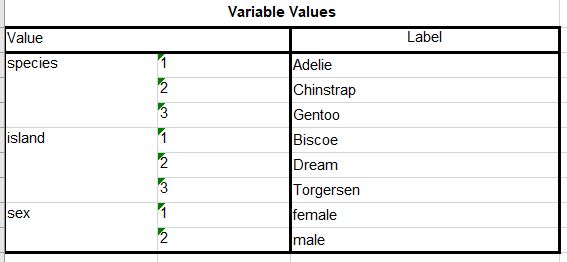

---
output:
  pdf_document: default
  html_document: default
---


```{r setup_ch250, include=FALSE, eval=TRUE}
source("package_load.R")

```


# Importing data: statistical software {#importing-stats}

In this chapter:

* Importing survey data from statistical software packages that include labelled data formats\index{labelled variables}, with an emphasis on SPSS\index{SPSS}

* Importing survey data from an Excel file, including the data dictionary created by survey software, and creating labels from the data dictionary.

* Importing plain-text data and applying syntax from statistical software packages to apply labels and output as statistical software data formats, with an emphasis on SPSS.


## Statistical software


If you are one or work with statisticians, economists, sociologists, survey practitioners, and many others, you will find yourself encountering data files created using the software packages SAS\index{SAS}, SPSS\index{SPSS}, and Stata\index{Stata}. These tools have been around a long time (SAS and SPSS trace their history back to the late 1960s, and Stata was created in 1985), and over the years they have evolved, demonstrated their robustness, and have become common in many academic, corporate, and government settings. 

A feature of these programs is that the variables and the associated values can be _labelled_\index{labelled variables}. If you're familiar with **R**, value labelling is conceptually similar to the use of factor labels. These labels can carry a great deal of detail to which you might otherwise not have easy access.

The **R** package {haven} [@R-haven] provides the functionality to read these three types of files. ^[The reference page for {haven} is here: https://haven.tidyverse.org/index.html] There are other packages related to {haven} that we will also use.


`library(haven)`

In the following examples, we will use versions of the data in the {palmerpenguins}\index{palmerpenguins} data [@Horst_Presmanes_Hill_Gorman_2022; @R-palmerpenguins]. We will work with SPSS formatted files; the approach is similar for SAS and Stata formats, and only differs in the details. For example, the `haven::read_()` functions vary only with the extension; a Stata data file has the extension ".dta", so the read function is `read_dta()`:


```{r, eval=FALSE}

haven::read_dta(dpjr::dpjr_data("penguins.dta"))

```

The equivalent for a SAS file is as follows:


```{r, eval=FALSE}

haven::read_sas(dpjr::dpjr_data("penguins.sas"))

```

Here's the code to read that same data file in SPSS's ".sav" format and assigns it to an R object `penguins_sav`:

```{r}

penguins_sav <- haven::read_sav(dpjr::dpjr_data("penguins.sav"))

penguins_sav
```

You will notice that the values of the variables in the `.sav` version of the `penguins` dataframe are different than what was read in from the `.csv` version. All of the variables, including those that were character strings, are numeric. For example in the variable "species" the values are a column of "1"s, "2"s, and "3"s instead of being the names of the species.

Note also that in the variable descriptions, it includes `<S3: haven_labelled>` for those that bring the SPSS labels with them.


### {labelled} -

Once we have read our SAS, SPSS, or Stata data into R using one of the {haven} functions, the package {labelled}[@R-labelled] gives us a range of powerful tools for working with the variable labels, value labels, and defined missing values.


```{r 250-labelled}
library(labelled)
```


The first function we will use is `look_for()`, which returns the labels, column types, and values of the variables in our data.

```{r 250-look_for}
look_for(penguins_sav)
```

In this view, we can spot the species names in the "values" column. Also notice that the "col_type" column shows "dbl+lbl": double and label. In this dataframe, no labels have been defined.

The function `var_label()` allows us to add a descriptive label to a variable. In the next code chunk, we add a label to the `species` variable:

```{r}
var_label(penguins_sav$species) <- "Penguin species"

```

The label is now incorporated into the dataframe:

```{r}
look_for(penguins_sav)
```

It's also possible to add multiple labels. Note that in this example, a label is added to both "dbl+lbl" and "dbl" types.

```{r}
var_label(penguins_sav) <- list(island = "Island of record", 
                                body_mass_g = "Weight, in grams")

look_for(penguins_sav)
```


#### Using labels

The labels\index{labelled variables} in an dataframe created by {haven} can be converted to a factor type, using the `unlabelled()` function. 

If we were to tally the number of penguins in each species using the penguins dataframe that originated from the SPSS\index{SPSS} file, we would see this:

```{r}
penguins_sav |> 
  group_by(species) |> 
  tally()

```

In this version, the "species" variable retains the numeric values.

By applying the `unlabelled()` function, the "haven_labelled" type variables are transformed into factor types, with the labels (that is, the species names) now the shown in our summary table:

```{r}
penguins_sav |> 
  unlabelled() |> 
  group_by(species) |> 
  tally()

```


An alternative approach is to the explicitly change the variable type, with a `to_factor` transformation inside one of the mutate functions, `mutate()` and `mutate_if()`. In this first example, the variable `species` is mutated from labelled\index{labelled variables} to factor type.

```{r}
penguins_sav |> 
  mutate(species = as_factor(species)) |> 
  group_by(species) |> 
  tally()
```


In this second variant, the `mutate_if(is.labelled)` function transforms all of the labelled variables.

```{r}
penguins_sav |> 
  mutate_if(is.labelled, to_factor) |> 
  group_by(species, island) |> 
  tally()
```


### Reading an SPSS\index{SPSS} survey file: "Video"

The functionality of a labelled dataframe is very beneficial when working with survey data. The dataframe can contain the variable codes as captured in the form, the values associated with those values, as well as the text of the question in the label.

The file used in this example comes from the University of Sheffield Mathematics and Statistics Help's ["Datasets for Teaching"](https://www.sheffield.ac.uk/mash/statistics/datasets)

> This dataset was collected by Scott Smith (University of Sheffield) to evaluate the use of best method for informing the public about a certain medical condition. There were three videos (New general video A, new medical profession video B, the old video C and a demonstration using props D). He wanted to see if the new methods were more popular so collected data using mostly Likert style questions about a range of things such as understanding and general impressions. This reduced dataset contains some of those questions and 4 scale scores created from summing 5 ordinal questions to give a scale score.

If you were working in SPSS\index{SPSS}, when you open the file, you would see the data like this:


SPSS also gives you the option to view the variables:


In this view, we can see both the variable names and the variable labels (in this case, the precise wording of the survey question).


And we can also drill deeper, and see the value labels:


The R package {haven} allows us to capture all of this information.


#### Read SPSS\index{SPSS} data into R

For the first step, we will read in the data from the SPSS\index{SPSS} file with the default parameters.

```{r}

df_video <- read_spss(dpjr::dpjr_data("Video_SPSS.sav"))

# display the data in the console
df_video

```

Some of the variable names have leading `@` (at sign)—they will cause us some headaches later, so let's use the `clean_names()` function from the {janitor} package [@R-janitor]^[The reference page for {janitor} is here: http://sfirke.github.io/janitor/] to clean them up.


```{r}

df_video <- janitor::clean_names(df_video)

```


Now, we can use the `look_for()` function from {labelled} to view the contents of the dataframe:


```{r 250-look_for_1, eval=FALSE}
look_for(df_video)
```


#### Handling missing values 

Very often, SPSS\index{SPSS} files will have "user defined missing values."\index{missing values} In the video survey file, they have been coded as "NA". But often, the analysis of survey results will have multiple types of "missing values":

* respondent left the question blank

* respondent didn't answer the question because of skip logic (in other words, the respondent didn't see the question)

* the analyst may have decided to code "Don't know" or "Not applicable" as "missing" when calculating the percentages of responses in the other categories.

Depending on the circumstance, you may want to count some of these. For example, if there a lot of "Don't know" and "Not applicable" responses, you may wish to analyze which one it is (they mean very different things!) If they are all coded as "NA", you have lost the ability to gain that insight.

In the code below, adding the `user_na = TRUE` argument to the `read_spss()` function maintains the original values.

```{r 250_read_spss_video}
df_video <- read_spss(dpjr::dpjr_data("Video_SPSS.sav"), user_na = TRUE)

df_video <- janitor::clean_names(df_video)

df_video

```

What were "NA" in the first version are now "0".


#### Exploring the data

The `attributes()` function gives us a way to view the details of the variables.

First, we can look at the attributes of the whole dataframe.

```{r}

attributes(df_video)

```

Or we can use the dollar sign method of specifying a single variable; in this case, `heardofcondition`:

```{r}

attributes(df_video$heardofcondition)

```

In the output above, the `$label` is the question, and the `$labels` are the labels associated with each value, including N/A. Note that there's also a `$na_values` shown.

You can also string these together in our code. For example, if we want to see the value labels and nothing else, the code would be as follows:


```{r}

attributes(df_video$heardofcondition)$labels

```


### Factors

Factors behave differently than labels: they don't preserve both the label and the value. Instead they display the value and preserve the sort order (that can be either automatically set or defined in the code).

In the code below, we will set all of the variables in the `df_video` dataframe as factors. In the first code chunk there are no additional parameters.

```{r}

(df_video_factor <- as_factor(df_video))

```

In this second chunk, the `levels` parameter is set to `both`.

```{r 250-df_video}

(df_video_both <- as_factor(df_video, levels="both"))

```


## Creating a labelled\index{labelled variables} dataframe from an Excel file

You might encounter a circumstance where the data collectors have originally used SPSS\index{SPSS}, SAS\index{SAS}, or Stata\{Stata}, but share the data as an Excel file. This might be because the receiving organization does not have the proprietary software, and the ubiquity of Excel as an analytic tool makes it a functional choice.

Typically in these circumstances, the data collectors make the data available in two parts: 

* The individual records, with the variables coded numerically.

* A separate "code book", with the labels associated with each numeric value.


In the following example, the Palmer penguins data\index{palmerpenguins} [@R-palmerpenguins] has been stored in an Excel file. The first sheet in this Excel file contains the data, where the values in the three character variables (species, island, and sex) have been converted to numeric codes. For example, for the species variable, the Adelie penguins are represented by the value "1", Chinstrap are represented by "2", and Gentoo are represented by "3".


```{r penguins_labelled, eval=FALSE}
penguins_path <- dpjr::dpjr_data("penguins_labelled.xlsx")

penguins_data <- read_excel(penguins_path, sheet = "penguins_values")

head(penguins_data)

```


```{r, echo=FALSE, eval=FALSE}
# alternative approach with {dpjr} package
library(dpjr)
penguins_path <- dpjr_data("penguins_labelled.xlsx")

penguins_data <- read_excel(penguins_path, sheet = "penguins_values")


```


A glance at the dataframe shows that the variables `species`, `island`, and `sex` are all coded as numeric variables. Unlike the ".sav" file we read earlier in this chapter, this dataframe does not carry the labels as part of the variable.

We could write some code to apply labels and change the variable type, using the `val_labels()` function from the {labelled} package:

```{r, eval=FALSE}
# assign the species names as labels
labelled::val_labels(penguins_data$species) <- 
  c("Adelie" = 1, "Chinstrap" = 2, "Gentoo" = 3)

# view the labels
val_labels(penguins_data$species)

# another way to view the labels 
attr(penguins_data$species, "labels")

```


We can also use R to read in the values and apply them programmatically. This will save time and effort and reduce the risk of typographical errors, particularly if there are many variables and those variables have many values to label.

If we return to the Excel file "penguins_labelled.xlsx" we find that the second sheet in the Excel file is called "penguins_codebook_source". This sheet contains the output SPSS\index{SPSS} creates when the "DISPLAY DICTIONARY" syntax (or the "File > Display Data File Information > Working File" GUI menu sequence) in SPSS is used to produce the "dictionary" (or codebook). There is information about each of the variables, including whether that variable is nominal or scale.

Of particular interest to us are the values associated with each variable. This information is saved under the heading "Variable Values"; for the penguins data file, this appears in row 36 of the Excel sheet.



First, we read the contents of a specific rectangle of data in the second sheet in the Excel file, containing the code book. Note that we start reading at row 37, so that "Value" and "Label" are assigned as our variable names. In this code, the "anchored" approach is used, where the upper left corner Excel cell is specified, and then the number of rows and columns to be read in the `dim =` argument.

```{r, eval=FALSE}

penguins_path <- dpjr::dpjr_data("penguins_labelled.xlsx")

penguins_code <- read_excel(penguins_path,
                            sheet = "penguins_codebook",
                            range = anchored("A37", dim = c(9, 3)))

penguins_code


```

We have read the table as output by SPSS\index{SPSS} and saved in the Excel file, but there is additional wrangling required.

The first step in the pipe is to rename the variables. Not only has the name `Value` been given to the "Variable" column, but the name of the value column has been interpreted as blank and has been assigned the variable name `...2`. 

The second step is to use the {dplyr} `fill()` function to populate the missing values in the `variable` variable. The default direction of the fill is downwards, so we don't need to specify the direction as an argument. We will examine other options for cleaning data later.

```{r, eval=FALSE}

penguins_code <- penguins_code |> 
  # rename variables
  rename(Value = "variable",
    ...2 = "variable_value",
    Label = "variable_label") |> 
  # fill in blank names
  fill(variable) |> 
  # change to numeric
  mutate(variable_value = as.numeric(variable_value))

penguins_code

```


At this point, there are two possible solutions:

1. Join the values from the "penguins_code" dataframe, so that in addition to the variable with numeric values, there is also a variable with the character strings.

2. Using the functions in the {labelled} package, convert the variables into "labelled" type, so the the numeric values remain and the labels are applied. In this scenario, the end-state is the same as reading the SPSS\index{SPSS} file directly.


**Final step: join variables**


```{r, eval=FALSE}
penguins_code_wide <- penguins_code |> 
#  mutate(row_num = row_number()) |> 
  pivot_wider(names_from = c(variable), values_from = variable_label)

penguins_code_wide
```


## Creating a labelled dataframe from SPSS syntax

In the previous chapter, we imported data files that had been created using the software packages SAS\index{SAS}, SPSS\index{SPSS}, and Stata\index{Stata}. We also saw how to work with _labelled_ variables\index{labelled variables}. 

In our quest for data to analyze, we might come across a circumstance where an organization has collected survey data, and the data collectors have published the individual records, allowing researchers like you and me to further explore the data.

These data files contain individual records, rather than a data file that has been summarized with counts and percentages. A file with the individual records is sometimes referred to as a "micro-file", and one that has been anonymized for publication might be described as a Public-Use Micro File\index{Public-Use Micro File} (abbreviated as "PUMF"\index{PUMF|see {Public-Use Micro File}}) or Public Use Microdata Sample (PUMS)\\index{PUMS|see {Public-Use Micro File}}.

In this chapter, we will look at two circumstances where the data collectors have done just that. But rather than releasing the micro-data in a variety of formats, they have published a bundle that contains the raw text flat file along with syntax (code) files that apply variable names, variable labels, and value labels. This is great if we have a license for one of those proprietary software tools^[Or a friend we can bribe with the promise of a chocolate bar.], but what if we are an R user?

Fortunately for us, there is a package that has functions to read a raw text file, and apply SPSS syntax to create an R object with labelled variables: {memisc} [@R-memisc].

`library(memisc)`


### National Travel Survey (NTS)

Our first example uses information from the National Travel Survey (NTS)\index{National Travel Survey (NTS)}, collected and published by Statistics Canada [@StatCan_NTS_2020]. 

Step 1 - Download the "SPSS" zip file for the 2020 reference period, and unzip it in the project sub-folder "data". This should create a sub-folder, so that the file path is now "data\\2020-spss"

The zip file does _not_ include an SPSS-format data file (.sav). Instead, the folder has a fixed-width text file for each of the three survey components (person, trips, and visits), and corresponding SPSS syntax files that can be used to read the files into the correct variables and to apply the variable and value labels. 

For this example, we will use the 2020 NTS "Person" file. The raw data file provided by Statistics Canada is "PERSON_NTS2020_PUMF.txt".


Step 2 - Use the SPSS syntax files (in R)


The bundle also includes separate SPSS syntax files with the ".sps" extension. Because Canada is a bilingual country, Statistics Canada releases two versions of the label syntax files, one in English and the other in French. They can be differentiated through the last letter of the file name, before the extension. These are:

* variable labels: "Person_NTS2020_Pumf_vare.sps" (The equivalent file with French variable labels is "Person_NTS2020_Pumf_varf.sps".)

* variable values: "Person_NTS2020_Pumf_vale.sps"

* missing values: "Person_NTS2020_Pumf_miss.sps"

This structure works very well with the {memisc} functions, and these files do not require any further manipulation. (As we will see in our second example, this is not always the case.)

Because Statistics Canada has made the data available from other years, we will consciously create flexible code that will permit us to rerun our code later with a minimum number of changes. Accordingly, we will assign the year of the data as an object.


```{r memisc_year}

nts_year <- "2020"

```

We can now use the object with the year number in a variety of ways, as we define the locations of the various input files. Note that this code uses the `glue()` function from the {glue} package to create the file name strings, and the `here()` function from the {here} package to determine the file path relative to our RStudio project location.


```{r memisc_inputs}

# define locations of input files

nts_year_format <- glue(nts_year, "-SPSS")

input_folder <- here("data", nts_year_format)
input_folder

layout_folder <- here("data", nts_year_format, "Layout_cards")
layout_folder

# use the above to create objects with file names and paths

data_file_1 <- glue("PERSON_NTS", nts_year, "_PUMF.txt")
data_file <- glue(input_folder, "/Data_Données/", data_file_1)
data_file

columns_file_1 <- glue("Person_NTS", nts_year, "_Pumf_i.sps")
columns_file <- glue(layout_folder, columns_file_1, .sep = "/")
columns_file

variable_labels_1 <- glue("Person_NTS", nts_year, "_Pumf_vare.sps")
variable_labels <- glue(layout_folder, variable_labels_1, .sep = "/")


variable_values_1 <- glue("Person_NTS", nts_year, "_Pumf_vale.sps")
variable_values <- glue(layout_folder, variable_values_1, .sep = "/")

missing_values_1 <- glue("Person_NTS", nts_year, "_Pumf_miss.sps")
missing_values <- glue(layout_folder, missing_values_1, .sep = "/")


```


The next stage is to create a definition of the dataset using the `memisc::spss.fixed.file()` import procedure.

```{r memisc_import}

# read file, create datafile with nested lists
nts_person_2020 <- memisc::spss.fixed.file(
  data_file,
  columns_file,
  varlab.file = variable_labels,
  codes.file = variable_values,
  missval.file = missing_values,
  count.cases = TRUE,
  to.lower = TRUE
)

# convert the resulting object into a "data.set" format 
nts_person_2020_ds <- memisc::as.data.set(nts_person_2020)

```


That dataset object is now converted into a tibble, using the `as_haven()` function. This tibble has all of the variable and value labels\index{labelled variables} assigned, accessible via the functions in the {labelled} package.


```{r convert_to_haven_tibble}

nts_person_2020_hav <- memisc::as_haven(nts_person_2020_ds)
nts_person_2020_hav

```


In our final step, we save the dataframe as SPSS, Stata, and RDS files for future use.

One important note for Stata users is that there is a "version" argument, which allows us to create a file that can be read by older versions of Stata (the default is Stata 15).


```{r export, eval=FALSE}
# export haven format table as SPSS .sav file
haven::write_sav(nts_person_2020_hav,
                 here("data_output", "nts_person_2020.sav"))

# export haven format table as Stata .dta file
haven::write_dta(nts_person_2020_hav,
                 here("data_output", "nts_person_2020.13.dta"),
                 version = 13)


# export RDS 
readr::write_rds(nts_person_2020_hav,
                 here("data_output", "nts_person_2020.rds"))

```


```{r, include=FALSE}
#detach("package:memisc", unload = TRUE)
```


<!-- 
This file by Martin Monkman is licensed under a Creative Commons Attribution 4.0 International License. 
-->

