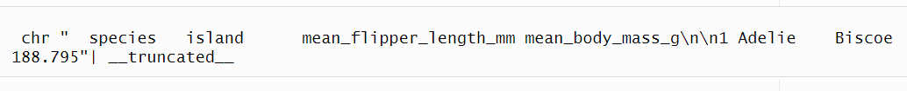
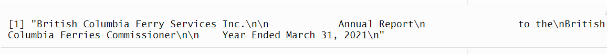
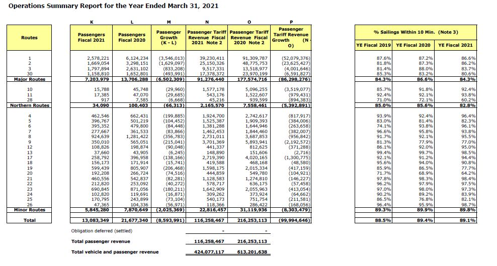
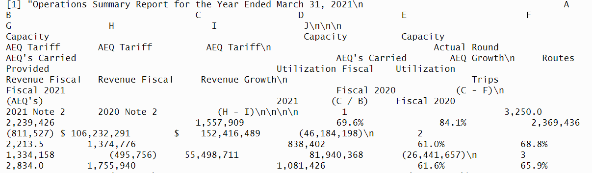
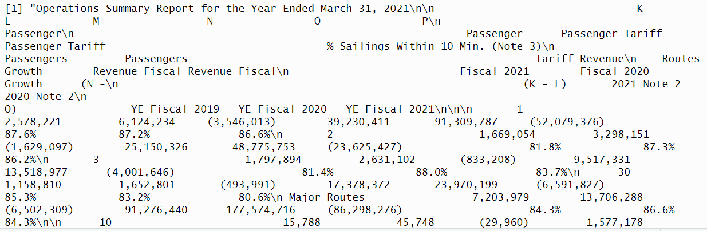
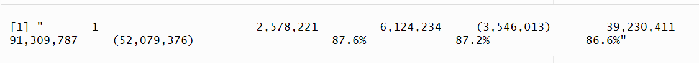
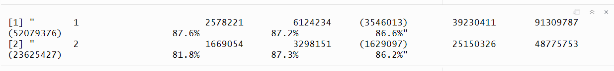
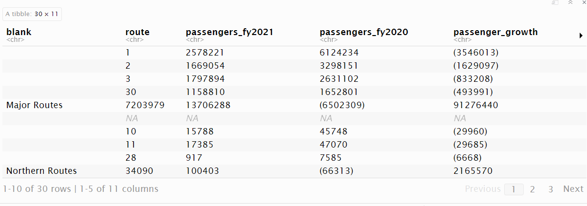
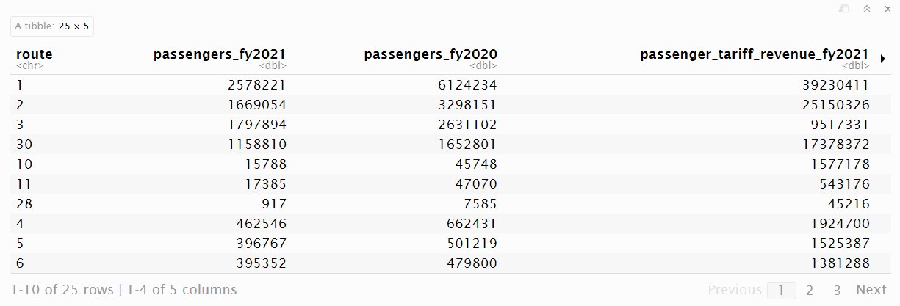
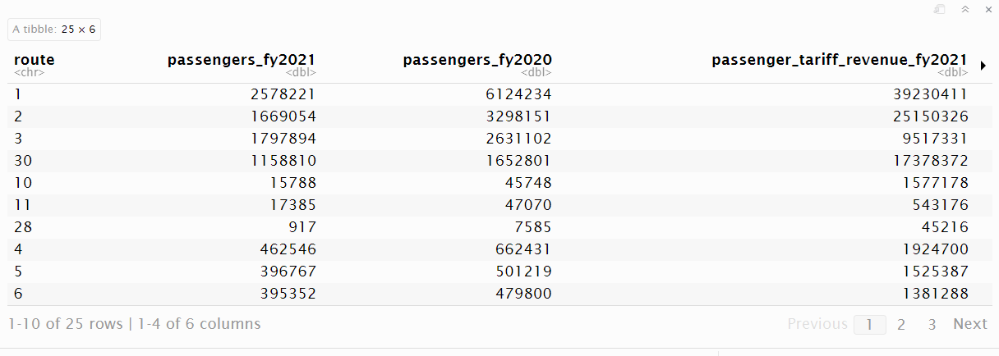

---
output:
  pdf_document: default
  html_document: default
---


<!-- 
This file by Martin Monkman is licensed under a Creative Commons Attribution 4.0 International License. 
-->


```{r setup_ch300, include=FALSE}

# packages
source("package_load.R")

options(width = 75)

```


# Importing data: PDF files {#pdf}

In this chapter:

* Reading data and text from PDF files

* Manipulating the resulting objects into a tidy structure


## PDF files

> Portable Document Format (PDF)\index{Portable Document Format (PDF)}...is a file format developed by Adobe in 1992 to present documents, including text formatting and images, in a manner independent of application software, hardware, and operating systems.^[Wikipedia entry, "PDF" [@wiki:PDF]]


The PDF file format provides a great deal of functionality and flexibility to create high quality output. PDF files are often used for things like  branded marketing materials and annual reports, where there is a use-case for a document that looks on screen as it would if printed on paper, with a combination of text and images, all designed and formatted in a way to make it visually appealing.


Included in those documents may be data we want for our analysis. Or we may want to analyze the text in the document. The way a PDF file is structured can make extracting the contents, whether it is data tables or text, a challenge. The "export to Excel" function in Adobe Acrobat and other PDF tools might work successfully; always give this a try first. The operative phrase in that sentence is _might work_. Similar to the challenges that we confront when importing a formatted Excel file, your PDF exporter will confront structures that look like tables visually, but which are not in a consistent tidy format. Sometimes text wrapping in variable names often leads to splitting into multiple rows, and in other instances what looks like multiple cells in the table is read as one.

Fortunately for us, other data scientists have already confronted the challenge of reading data tables in PDF files, and have made tools available for the rest of  us. One such package is {pdftools}[@R-pdftools]

In addition to {pdftools}, for this chapter we will also be using the data manipulation packages {dplyr} and {tidyr}, and the text manipulation package {stringr}[@R-stringr]

```{r library_pdftools, eval=FALSE}

# reading the contents of a PDF file
library(pdftools)

# data wrangling packages
library(dplyr)
library(tidyr)

# string manipulation
library(stringr)

```

### Getting started

To get started in reading data from a PDF file, we will read data from a summary of the {palmerpenguins} [@Horst_Presmanes_Hill_Gorman_2022; @R-palmerpenguins] data. 

While this is for a single table on a single page, the same approach will work for multiple tables across multiple pages, if the structure of each table on each page is the same. The process is always the same: start with the smallest unit, and expand out.

* The way that PDF files are read, the smallest unit is a single row.

* Expand that to the entire table. Apply column splitting and assigning headers at the end of this stage.

* If there are multiple tables wit the same structure, tackle that next by looping through each of the tables. 

* And once you have a single page working, you can loop through multiple pages.


We read the entire contents of the file using the `pdf_text()` function from the {pdftools} package, and assign the contents to an R object in our environment. 

Next we use the `str()` function to display a summary of the structure of our new object.

```{r}

penguin_summary <- pdf_text(dpjr::dpjr_data("penguin_summary.pdf"))

```

```{r, eval=FALSE}

str(penguin_summary)

```




What we have as a result of this is a single character string, with the contents of the file. In this example, there is only one page, and thus one string. If you are dealing with a multi-page document, each page gets its own string.

In a visual scan of this output, we see the variable names starting with `species`. After the last of the variables `mean_body_mass_g` there are two end of line characters, represented by "\\n" (pronounced "backslash n"). We will be using these end of line characters as part of the parsing process.


Another way to look at the contents of a page is to use the `cat()` function (from {base R}), which displays the contents as it would be printed:


```{r}
cat(penguin_summary)
```


Next we use the `strsplit()` function (from {base R}) to separate the long string into separate rows. As we noted there are two "\\n" character pairs marking the end of each line; if we use only one in the `strsplit()` function, an extra row appears between the data rows.


```{r}
penguin_summary_2 <- penguin_summary |> 
  strsplit(split = "\n\n")

penguin_summary_2
```

At this stage, we need to apply some cleaning. If we don't do it now, it's going to cause some challenges later. There is an extra line return at the end of the last data cell, so let's use a regular expression to remove it. There's also space at the beginning of the first line, and the number-space combination at the beginning of the data rows.

And by using the double square bracket accessor in the first row, the object returned is no longer nested, but instead has a single character string for each row.

```{r}
penguin_summary_3 <- penguin_summary_2[[1]] |> 
    str_remove("\\n$") |> 
  str_remove("^\\s+") |> 
  str_remove("^\\d ") 

```

Next, we create a list object with the variable names, in order to keep the names separate from the data in our resulting table. This is accomplished by assigning the row that contains the names (row 1, identified using the square bracket [1]) to a vector with one element.

```{r}

penguin_variable_vector <- as.vector(penguin_summary_3[1])

penguin_variable_vector
```

The next step is to split this vector into 4 separate elements at the points where there are one or more white spaces, identified in the regular expression "\\s+". The "\\s" finds a single space, and adding the "+" extends that to "one or more" of the character the precedes it.

This returns another nested list.

```{r}

penguin_variable_list <- str_split(penguin_variable_vector, "\\s+")
penguin_variable_list

```

In order to have the structure we need, we apply the `unlist()` function to the result.

```{r}
penguin_variable_names <- unlist(penguin_variable_list)
penguin_variable_names
```

It is possible to turn those two steps into one by wrapping the string split inside the `unlist()`:

```{r}

penguin_variable_names <- 
  unlist(str_split(penguin_variable_vector, "\\s+"))
penguin_variable_names

```


The next step is to build a table, using a for-loop. (See [@Wickham_Cetinkaya-Rundel_Grolemund2023, Chapter 27 Iteration] for a review of this process.)


```{r}
# 1. define output
penguin_table <- tibble(value = NULL)

# 2. loop through the rows
# Because the first element is the titles, 
# we want the length to be one shorter
loop_length <- length(penguin_summary_3) - 1

for (i in 1:5) {
  j <- i + 1
  dat <- as_tibble(penguin_summary_3[j])
  penguin_table <- bind_rows(penguin_table, dat)
}

penguin_table

```

The loop has created a tibble with one column, `value`. We will apply the `separate()` function to split the value into each of the variable names we assigned to the object `penguin_variable_names` earlier. The split is based on the location of one or more spaces in the original string, using the "\\s+" regular expression.

```{r}

penguin_table <- tidyr::separate(
  penguin_table, 
  value,
  into = penguin_variable_names,
  "\\s+"
  )

penguin_table

```

There is one final step: to change the variable types of the values to numeric.


```{r}
penguin_table <- penguin_table |> 
  mutate(
    across(
    contains("mean_"), 
    ~ as.numeric(.x)
    )
  )

penguin_table
```

### Extended example: ferry traffic

For this exercise, we will extract a data table from _Annual Report to the British Columbia Ferries Commissioner_ for the fiscal year ending March 31, 2021 (that is, the twelve month period from 2020-04-01 to 2021-03-31).

The report can be downloaded from the web here:  https://www.bcferries.com/web_image/h29/h7a/8854124527646.pdf

* Annual reports from previous years can be downloaded from this page: https://www.bcferries.com/in-the-community/resources


This report is 101 pages long, and contains a mixture of written text and data tables.


{pdftools} gives us the ability to download and read the file from a local copy, or from the web.


```{r 300_download_file, eval=FALSE}
# download file from web URL
download.file(
  url = "https://www.bcferries.com/web_image/h29/h7a/8854124527646.pdf",
  destfile = "bcferries_2021.pdf",
  mode = "wb"
  )

```


Once the file is downloaded, we can then read the file using the `pdf_text()` function and assign the contents to an R object in our environment. Of course, we also have the option to read a file that we've already downloaded.


```{r}

# alternative, from the {dpjr} package
bcf <- pdf_text(dpjr::dpjr_data("bcferries_2021.pdf"))

```

The code above produces a vector with 101 character strings—one for each page of the original document. We can access each page, using the square bracket accessor syntax of R. Here is the code to see the contents of the first page:


```{r, eval=FALSE}

bcf[1]

```




Using the `cat()` function:

```{r}

cat(bcf[1])

```


If we compare these two outputs, we see that the first shows the characters "\\n", which indicates the end of a line. These have been used to render the layout in the `cat()` version.


The period covered by this annual report captures the profound impact on travel during the first year of the COVID-19 pandemic, and the report has comparisons in vehicle and passenger volumes with the previous, pre-pandemic year. Let's pull the data from the table that compares the number of passengers by each of the routes in the system. This table is on page 11 of the PDF file:
 



From the object we created from the PDF report, we can separate the contents of page 11 into its own object:

```{r 300_bcf_p11}

bcf_11 <- bcf[11]
```

```{r, eval=FALSE}
bcf_11
```





Wait! This isn't the page we want! While the PDF file numbers the pages, the title page isn't numbered...so the page numbered "11" is in fact the twelfth page in the file.


```{r}

bcf_11 <- bcf[12]
```
```{r, eval=FALSE}
bcf_11
```





Now we have an object that is a single text string. All of the data we want is there, but it is going to take some finesse to extract the columns we want, and in a format that we can use.


Using the "\\n" line break character, we can split this single value into as many lines as there are on the page.

```{r 300_pdf_linebreak}
# break into lines
bcf_11_lines <- bcf_11[[1]] |> 
  strsplit(split = "\n")

# how many lines in the page?
length(bcf_11_lines[[1]])
```

Now we have a list of 1, with 55 individual elements in it.

The first thing that I notice is that the table starts a few rows down, and more problematically, the header row with the variable names is split due to text wrapping. I'm going to make the decision to enter the variable names manually, and focus on extracting the numbers. The numbers start at row 13, which we can access as follows:


```{r, eval=FALSE}
bcf_11_lines[[1]][13]
```





We can specify a range of rows; let's set up the first two rows as our tester sample.

```{r}
tester <- bcf_11_lines[[1]][13:14]

```


So how will we split this into separate pieces? Here's where the {stringr} package and our knowledge of regular expressions comes into use. We want to split the string where there are multiple spaces. If we split at every space, we'd get lots of columns. So we are separating (or splitting) where the spaces occur.

The regular expression to find any white space is "\\s", and to find any number of them we need to add the plus sign "+". Remember that in R, we need to escape the backslash, so our regex gets expresses as "\\s+". 

```{r}

test_result <- str_split(tester, "\\s+")
test_result
```

This remains a single list, now with two elements—one for each row.

Below, the code creates an object with a list of the variable names. (Sometimes it's more effective to tackle these cleaning problems head-on with a manual solution, rather than spend time on a one-time programmatic solution.)

```{r}
bcf_col_names <- c(
  "blank",
  "route",
  "passengers_fy2021",
  "passengers_fy2020",
  "passenger_growth",
  "passenger_tariff_revenue_fy2021",
  "passenger_tariff_revenue_fy2020",
  "passenger_tariff_growth",
  "pct_sailings_10_mins_fy2019",
  "pct_sailings_10_mins_fy2020",
  "pct_sailings_10_mins_fy2021"
)

```

```{r}

as_tibble(test_result, .name_repair = "unique")

```


```{r}
bcf_table <- tibble(value = NULL)

for (j in 1:2) {
  dat <- as_tibble(tester[j])
  bcf_table <- bind_rows(bcf_table, dat)
}  

bcf_table
```

```{r}

bcf_table_2 <- tidyr::separate(bcf_table, value, 
                               into = bcf_col_names,
                               "\\s+")

glimpse(bcf_table_2, width = 65)
```

Hooray! (I should have left in all the failed attempts I made, before getting to this result...a lot of attempts that either failed outright, or ones where I managed a step or two before getting stuck.)

Except...all of the variables are character type, because of the commas that are used as thousand separators and the percent signs.

Let's go back to the `tester` object, and see what we can do to pull them out the commas using the {stringr} function `str_remove_all()`. (Note that `str_remove()` removes the first instance of the specified string.)

For the purpose of our exercise, we won't worry about the numbers in parentheses, which are the difference between the two previous variables (and since they are negative, they are represented using the accounting format style of being in parentheses.) We won't deal with the percentages, but the percent signs could be removed in the same way as the commas.

```{r, eval=FALSE}
# remove all commas
str_remove_all(tester, ",")

```





Now let's put all of this together to capture the full table.

```{r, warning=FALSE}
# read the relevant rows and remove the commas
bcf_data <- bcf_11_lines[[1]][13:42]
bcf_data <- str_remove_all(bcf_data, ",")

# set up the variable (column) names
bcf_col_names <- c(
  "blank",
  "route",
  "passengers_fy2021",
  "passengers_fy2020",
  "passenger_growth",
  "passenger_tariff_revenue_fy2021",
  "passenger_tariff_revenue_fy2020",
  "passenger_tariff_growth",
  "pct_sailings_10_mins_fy2019",
  "pct_sailings_10_mins_fy2020",
  "pct_sailings_10_mins_fy2021"
)


# set up the final table
bcf_table <- tibble(value = NULL)

# bind the rows together
for (j in 1:30) {
  dat <- as_tibble(bcf_data[j])
  bcf_table <- bind_rows(bcf_table, dat)
}  

bcf_table

bcf_table_2 <- tidyr::separate(bcf_table, value, 
                               into = bcf_col_names,
                               "\\s\\s+")
```

```{r bcf_table_2, eval=FALSE}
bcf_table_2
```





It's not quite perfect, and some things need to be removed: 

  * there's the route type sub-total rows
  * a blank row
  * the difference columns

```{r 300_remove_NA}
bcf_table_3 <- bcf_table_2 |> 
# succinct way to remove a row which has a single "NA"
  na.omit() |> 
  select(route,
         starts_with("passengers_"),
         starts_with("passenger_tariff_rev")) |> 
  # change variables to numeric
  mutate(passengers_fy2021 = as.numeric(passengers_fy2021),
         passengers_fy2020 = as.numeric(passengers_fy2020),
         passenger_tariff_revenue_fy2021 = 
           as.numeric(passenger_tariff_revenue_fy2021),
         passenger_tariff_revenue_fy2020 = 
           as.numeric(passenger_tariff_revenue_fy2020))
```

```{r bcf_table_3, eval=FALSE}

bcf_table_3

```





If we need to create sub-totals by route type, it would be better to have a separate variable for that. Here's where we can use the `case_when()` function from {dplyr}.

```{r}

bcf_table_3 <- bcf_table_3 |> 
  mutate(route_type = case_when(
    route %in% c("1", "2", "3", "30") ~ "major",
    route %in% c("10", "11", "28") ~ "northern",
    TRUE ~ "minor"
  ))

```

```{r, eval=FALSE}

bcf_table_3
```





Now we can use our data wrangling skills to calculate the percent change between the two years. Let's look at the change in passenger volume.

```{r}

bcf_table_3 |> 
  group_by(route_type) |> 
  summarize(total_fy2021 = sum(passengers_fy2021),
            total_fy2020 = sum(passengers_fy2020)) |> 
  mutate(pct_change = 
           (total_fy2021 - total_fy2020) / total_fy2020 * 100)

```


Our analysis: The COVID-19 pandemic had an _enormous_ impact on travel. The fiscal year 2021 covers the period April 1, 2020 through March 31, 2021...starting almost exactly as the  strict limitations to travel were imposed. Even though the restrictions started to lift later in the 12-month period, the travel on the major routes was down by nearly half.


