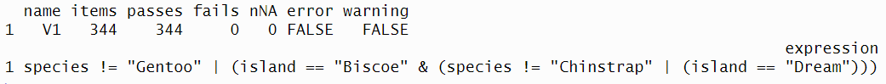
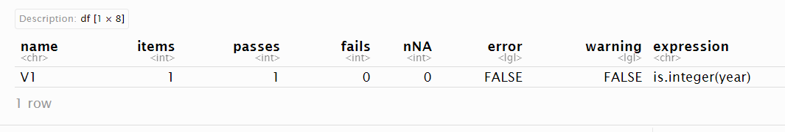
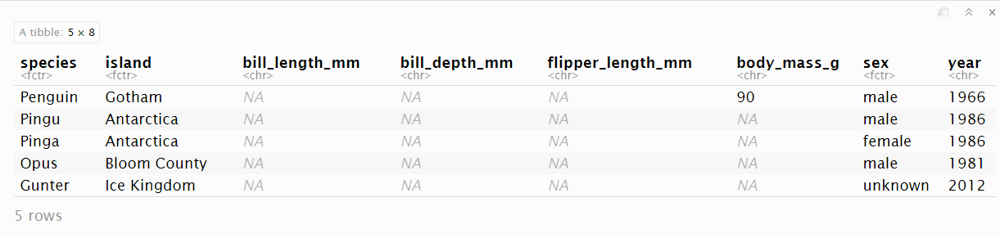

---
output:
  pdf_document: default
  html_document: default
---


<!-- 
This file by Martin Monkman is licensed under a Creative Commons Attribution 4.0 International License. 
-->


```{r setup_ch600, include=FALSE, eval=FALSE}

# packages
source("package_load.R")


```


# Exploration and validation strategies {#validation}

In this chapter:

* Exploratory data analysis to identify problems, including the {skimr} package

* Using structured tests with the {validate} package


## Identifying dirty data

Earlier in Chapter \@ref(foundations), challenges associated with "dirty data" were introduced. 

**The first challenge**: How do we find the things that are problematic with our data?

**The second challenge**: What can and should we do about them?


The term "data validation"\index{data validation} sometimes applies to verification that is applied when the data is collected (for example, in a web-based survey tool), and in other contexts it applies to a programmatic approach to ensuring the data meet specified conditions. In both cases, we can think of data validation as a form of quality control, from quick sanity checks to rigorous programmatic testing. [@White_etal_nine_simple_ways]

Validation of data during collection might be through the use of drop-down boxes that eliminates spelling mistakes, or entry fields that require the entered text to match a particular pattern. For example, a Canadian postal code is always in the pattern of capital letter (but not all letters), digit from 0 to 9, capital letter, space, digit, capital letter, and digit. The first letter of the postal codes specify a region; in Newfoundland and Labrador they start with the letter "A" while in Yukon they start with "Y", adding another dimension for possible validation. Electronic data collection can also enforce that an element is completed before submission. 

These imposed validation rules come with risks, and need to be thoughtfully implemented. Forcing a person to complete a field might lead to made-up values, which might be worse than a missing field. Imagine forcing someone to report their income—they might not be comfortable sharing that information, and in order to fulfill the requirements of the field enter a "1" or a preposterously very large number, neither of them accurate. In this case, it might be better for the form to provide a "Prefer not to answer" field, giving respondents an option that does not distort the final result.


For our work here, we will focus on checking and validating data after it has been collected. The analyst can specify parameters prior to it being made available for the next steps. These can be expressed as rules or assumptions, and are based on knowledge of the subject. [@Van_der_Loo_de_Jonge_2018, Chapter 6: Data Validation]

The type of things we might evaluate include:

* A field has to be structured in a certain way; examples include postal codes and date fields. 

* A value might have a certain range, or a limited number of categories.

* Some values, such as age, have to be positive.

* There might be a known relationship between two or more variables.


We now turn to approaches to evaluate the values in the data.


## Exploratory data analysis

One way to identify dirty data is through the process of _exploratory data analysis_ (EDA).\index{exploratory data analysis} \index{EDA|see{exploratory data analysis}} [@Tukey_1977] The EDA process is, first and foremost, intended to help guide our analysis, but it has the additional benefit of providing clues about the ways that our data is dirty.

EDA consists of two groups of techniques:

* summary statistics

* data visualization


The things we are looking for at this stage include:

* the variable types

* missing values

* invalid values and outliers, including sentinel values

* data ranges that are too wide or too narrow

* the units of the data


(Adapted from [@Zumel_Mount_2019, p.54])


For this example, we will look at some synthetic data about the employees of a company. The data is stored in multiple sheets of an Excel file; we will explore the data in the sheet "df_HR_train", which records whether someone has completed the mandatory training courses or not.

```{r}

readxl::excel_sheets(dpjr::dpjr_data("cr25/cr25_human_resources.xlsx"))


```

Once we have read the data into our environment, we can use some EDA methods to check the data.

```{r}

df_HR_train <-
  readxl::read_excel(dpjr::dpjr_data("cr25/cr25_human_resources.xlsx"),
                     sheet = "df_HR_train")

```

One way we might begin our investigation is the `dplyr::glimpse()` function. This function returns the dimensions of the dataframe, the variable types, and the first few values of each variable.

```{r training_glimpse_600}
glimpse(df_HR_train, width = 65)
```

The variables that start with `train_` have been stored as character _<chr>_, because of the "NA" string in the original Excel file. This variable could be more useful in our analysis if it was instead stored as logical. One option is to mutate the variable types on the existing object in our environment, or (taking the "go as far as possible at the import stage" approach) we can reread the contents of the file and apply the variable type definition at that point. The second option also gives us a way to explicitly define as `NA` those variables where it has been coded as a different character. Here `NA` is represented as "NA", but in other data you may encounter "not available", "9999", "-", and host of other possibilities.

```{r}

df_HR_train <-
  readxl::read_excel(
    dpjr::dpjr_data("cr25/cr25_human_resources.xlsx"),
    sheet = "df_HR_train",
    col_types = c("text", "logical", "logical", "logical", "logical"),
    na = "NA"
  )

glimpse(df_HR_train, width = 65)

```


Now that the variables are all in a type that suits what is being represented, applying R's `summary()` function gives us another way to see the data.


```{r}
summary(df_HR_train)
```


This output is our preliminary EDA. What do we notice? Because there are no numeric values, we are not looking for outlier values or sentinel values, or the range of the values. 

A few NA values might be expected in a survey dataframe like this, and a handful may not have an impact on our analysis. But the `train_qc` variable has 395 missing values—nearly 40% of the 999 records. There might be a reason for a large number of missing values, and part of the analyst's responsibility is understand why this might be the case. First, record that you've observed this in your notes about the data. 

A thorough understanding of the data and its origins will ensure that your analysis is accurate. Further investigation (and record keeping) of this situation is warranted. You might start with the data documentation you received with the file. If that doesn't hold an explanation, talk to the people who understand how the data are collected, and then the people in the human resources department...perhaps there's a policy that exempts a group of employees from what is otherwise a mandatory course.


### Data visualization

A plot can show us a wealth of information that cannot be expressed in the summary statistics. Let's work through exploring the date of birth variable from the `df_HR_main` sheet.


```{r read_HR_main_600}

df_HR_main <-
  read_excel(
    path = dpjr::dpjr_data("cr25/cr25_human_resources.xlsx"),
    sheet = "df_HR_main",
    range = "B5:E1004"
  )

head(df_HR_main)

```

Again we will use the `glimpse()` and `summary()` functions to start our exploration:

```{r}
glimpse(df_HR_main)

summary(df_HR_main)
```


In the midst of this information is an interesting anomaly—you may have spotted it. It is one that is far more visible if we plot the data. Below is a density plot that shows the distribution of birth dates of the staff:


```{r}
ggplot(df_HR_main, aes(x = date_of_birth )) +
  geom_density()

```


With a plot it is easy to see that there are a handful of birth dates around the year 1900, and then it takes off in the 1950s.

Here are some questions that we might want to explore further in the `date_of_birth` variable, after seeing the results of the `summary()` function and the plot:

* The earliest birth date is 1901-01-01. This would mean that the oldest staff member was 119 years old at 2020-01-01, the point at which the dataset was created. Perhaps you are already aware of the fact that only one person whose age has been independently verified lived long enough to celebrate their 120th birthday (they were 122 years, 164 days old when they passed away). ^[[Wikipedia, "List of the verified oldest people"](https://en.wikipedia.org/wiki/List_of_the_verified_oldest_people)] A possibility is that 1901-01-01 is a sentinel value\index{sentinel value}, inserted as a placeholder for unknown or missing values. Further exploration will help our understanding; we can start with counting the number of cases for any particular date:

```{r}
df_HR_main |> 
  group_by(date_of_birth) |> 
  tally() |> 
  arrange(desc(n)) |> 
  head()

```

There are 10 cases with the birth date entry of 1901-01-01...this is the sort of pattern we would see with a sentinel value.

Another approach to investigating this might be to derive a single year "age" variable from the date of birth, and visualize age using a box-and-whisker plot by one of the categorical variables to make outliers more apparent. We have a hunch that the "1901-01-01" sentinel value for date of birth might be associated with one category of occupation. Using our relational database "join" skills, we link the occupation variable from the "transaction" table and use occupation as a grouping variable in our plot. You'll notice that the transaction table is not in a structure that suits our analysis needs, so we have to do some data wrangling first.

```{r}
# step 1: read transaction table, which contains occupation
df_HR_transaction <- 
  read_excel(
    path = dpjr::dpjr_data("cr25/cr25_human_resources.xlsx"),
    sheet = "df_HR_transaction",
    na = "NA"
  )

# step 2: determine occupation on the date the table was created 
df_HR_occupation_2020 <- df_HR_transaction |> 
  group_by(emp_id) |> 
  summarize(occupation_current = max(occupation, na.rm = TRUE))

# step 3: in the main table calculate age and 
#   join the occupation table created in step 2,
#   then plot the result
df_HR_main |>
  # calculate age on January 1, 2020
  mutate(age_2020 =
           date_of_birth %--% ymd("2020-01-01") %/% years(1)) |>
  # join the current occupation table
  left_join(df_HR_occupation_2020, by = "emp_id") |>
  # plot
  ggplot(aes(x = occupation_current, y = age_2020)) +
  geom_boxplot()

```


In the box-and-whisker visualization, we see that the sentinel values are in four of the five occupations, so the hunch was not correct. 


## Validation methods

While exploratory data analysis uses visualization and scans of data summaries to spot potentially dirty data, validation is a structured process of testing.

### The {validate} package

As with other data analysis topics, people in the R user community have confronted the problem of dirty data, and have written and shared functions to help the rest of us. The {validate} package [@van2021data, @R-validate] was written and is supported by methodologists at Statistics Netherlands, and provides tools for us to write structured validation tests.

The first function we will investigate in the package is `check_that()`, using the data in {palmerpenguins} [@Horst_Presmanes_Hill_Gorman_2022; @R-palmerpenguins]. We know that the data in the package are nice and clean—they have already gone through a validation process.

```{r ch600_packages, eval=FALSE}
library(tidyverse)

library(palmerpenguins)
library(validate)

```


**Range of values**: 

We know, being experts on all things penguin, that gentoo penguins (_Pygoscelis papua_) are the third largest of the penguin species, and can weigh up to 8.5 kg. So we might want to see if we have any records with penguins with a body mass of more than 8500 grams. The `check_that()` function inverts this question; we are ensuring that all of the records have penguin body mass values that are less than or equal to 8500 grams. If the value is below that value, it returns a "pass". 


```{r ch600_penguin_check01, eval=FALSE}

check_penguins <- check_that(penguins, body_mass_g <= 8500)

summary(check_penguins)

```

The `summary()` function on the object that the `check_that()` function creates shows that all of the penguins have a body mass of less than or equal to 8500 grams, and there are 2 "NA" values in the data.


**Relationship:** 

While the heaviest gentoo penguins can be up to 8.5 kg, it is very unusual to find an Adélie or Chinstrap penguin that weighs more than 5 kg. What happens if we change the body mass threshold to 5000 grams?

```{r, eval=FALSE}

check_penguins <- check_that(penguins, body_mass_g <= 5000)

summary(check_penguins)

```

In addition to telling us that there are 61 records where the value in the `body_mass_g` variable is greater than 5000 grams, it is also letting us know that there are 2 `NA` values.

We can add an `if()` statement that filters out the gentoo penguins, and then check the body mass.


```{r, eval=FALSE}

check_penguins <- check_that(
  penguins,
  if (species != "Gentoo") body_mass_g <= 5000
  )

summary(check_penguins)

```

Now all the records (except the single "NA") pass. What has happened? The first thing is that we have excluded all of the gentoo penguins—if it's gentoo, it gets marked "pass". All the remaining penguins (that is, the chinstrap and Adélie birds) are evaluated against the body mass value of 5000 grams. And they all pass.

Let's explore the data a bit more...if we filter our penguins by those that are over 5000 grams, what do we find?

```{r}
penguins |>
  filter(body_mass_g > 5000) |> 
  distinct(species)

```

So this is confirms that all of the heavier penguins are gentoos, meeting our expectations.


**Range:** 

We know that the {palmerpenguin} data is from three seasons of measurement, 2007–2009. We can write a validation test to ensure that our `year` variable falls within that range.

```{r}

check_penguins <- check_that(penguins, year >= 2007 & year <= 2009)
summary(check_penguins)

```

What if we check for a single year?

```{r}
check_penguins <- check_that(penguins, year == 2009)
summary(check_penguins)

```

The output gives us the number of cases in that year in the `passes` the test, and the number of cases that are not in that year in the `fails`.


**Relationship**: 

We know that some species have only been measured on one of the three islands. Gentoo penguins have only been sampled on Biscoe Island, and chinstrap penguins in our sample come only from Dream Island. Does the data reflect that?

In the first test (labelled `g` for gentoo), if it's not a gentoo it gets included in the `passes`—and if it is a gentoo, it has to be on Biscoe Island to get a pass. In the `c` (for chinstrap) test, we will do the same for chinstrap penguins, which should all be on Dream Island.


```{r}

check_penguins <-
  check_that(penguins,
             g = if (species == "Gentoo") island == "Biscoe",
             c = if (species == "Chinstrap") island == "Dream")

summary(check_penguins)

```

The output now includes the results of the two tests. Both tests have all of the cases pass, and none fail. 

We could have written code to generate a summary table to check this. In many datasets, however, there will be too many combinations to reliably investigate in this manner.

```{r}
penguins |> 
  group_by(species, island) |> 
  tally()
```

A single `check_that()` test could be written using the "AND" operator `&`.

```{r}

check_penguins <- 
  check_that(penguins,
             if (species == "Gentoo") island == "Biscoe" &
             if (species == "Chinstrap") island == "Dream")

```

```{r summary_check_penguins, eval=FALSE}

summary(check_penguins)

```





We can also test against a defined list. This strategy can be useful if there is an extensive list against which we need to evaluate our data. Imagine checking the spellings of every city and town in the region where you live...if you have pre-defined list of those names in an existing data file, that list can be read into your R environment, and the test run against that list. In this example, an object called `island_list` is created, and the validation check is run against the contents of that list.

```{r}
island_list <- c("Biscoe", "Dream", "Torgersen")

check_penguins <- 
  check_that(penguins, 
             if (species == "Adelie") island %in% island_list)

summary(check_penguins)


```

_What happens if we fail to include Dream Island in our list of islands where Adélie penguins are found?_


The {validator} also allows us to check variable types within our `check_that()` function. Because R stores a dataframe column as a single type, this returns only one pass/fail evaluation.

```{r, eval=FALSE}

summary(check_that(penguins, is.integer(year)))

```




### badpenguins

The "badpenguins.rds" file adds five fictional penguins to the original "penguins" table, including measurement data. Let's load the data file "badpenguins.rds" (an R data file) and run a couple of the tests we used earlier:


```{r}
badpenguins <- read_rds(dpjr_data("badpenguins.rds"))

tail(badpenguins)

check_penguins <- check_that(badpenguins, year >= 2007 & year <= 2009)

summary(check_penguins)

```

```{r}
check_penguins <- check_that(badpenguins, island %in% island_list)

summary(check_penguins)
```

In both cases, we get 5 "fails". 

### Investigating the fails

How can we check which records have failed?

{validate} provides two other functions, `validator()` and `confront()`, which give us a way to 

* run multiple checks at a time, and

* generate detailed record-by-record account of which records have failed our test.

First, we assign the syntax of our tests using `validator()` to an object "penguin_tests".


```{r}

penguin_tests <- validator(
  island %in% island_list,
  year >= 2007 & year <= 2009,
  body_mass_g <= 8500
)

penguin_tests

```

In the next step, we apply those tests in a sequence of "confrontations" using the `confront()` function, generating an output object that we can investigate.


```{r}

penguin_confront <- confront(badpenguins, penguin_tests)

penguin_confront

summary(penguin_confront)
```

Let's look at the last ten rows of the results of the `confront()` function of our `badpenguins` data. Rows 340 through 344 are original to the clean `penguins` dataset; 345 through 349 are the bad penguins. The first of the bad penguins fails on all three tests, while the others fail on the first two and have "NA" values for the third. 

```{r}

tail(values(penguin_confront), 10)

```


In this example, our prior knowledge of the data gives us the insight to quickly target the rows that failed the validation tests. In the real world, filtering the object that results from our validation tests will allow us to identify the rows that contain the records that fail the tests.

The function we use for this is `violating()`. The two arguments in the `violating()` function are 

* the original data frame `badpenguins` and 

* the object that resulted from the `confront()` function, `penguin_confront`.

```{r, eval=FALSE}

violating(badpenguins, penguin_confront)

```





Now we know the details of the cases that have failed the test, we can now make some decisions—based on our understanding of the research we are undertaking—how to deal with these cases.


