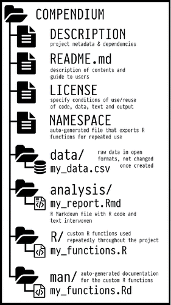

---
output:
  pdf_document: default
  html_document: default
---

<!-- 
This file by Martin Monkman is licensed under a Creative Commons Attribution 4.0 International License. 
-->

# Data documentation {#datadocumentation}

_the future chapter 8_

## Data documentation

The documentation of the data sources, methods, etc is vital for reproducibility\index{reproducibility}.

"Document and comment your code for yourself as if you will need to understand it in 6 months."
—Jenny Bryan

"If you're not thinking about keeping track of things, you won't keep track of things."
—Karl Broman

## Objectives

* Demonstrate understanding of the reasons for documentation and record keeping,

* Demonstrate understanding of the important elements to record, and

* Demonstrate the ability to create an artifact that captures the computing environment that a project was created in.

## Documentation and Recordkeeping

The reasons for documenting our workflow are similar to the reasons we would save and output our cleaned data file: 

* To make the project available to a collaborator. 

* To provide a record when we move to different jobs or projects (we would want others to do that for us!)

* To create a save point in our workflow, so that we can continue our work later but without having to go through all the steps to remember everything we've done.

, 2018-07-03_]](img/unfinished_work_400.png)

As well, things change (the data, the sofware and hardware we use, the motivations for our work) and capturing the details about those things helps us make any necessary changes that might be required at a later date.

There doesn't seem to be a single-best how-to instruction on "documentation" in the context of data science. The term appears in the periphery of some of the textbooks and manuals on how to do data science, and there are some journal articles that address documentation in the context of reproducible research. It seems what advice there is tends to be prescriptive at a high level, and not overly descriptive of what makes good documentation.

In the journal article "Good enough practices in scientific computing", the authors write

"Good documentation is a key factor in software adoption, but in practice, people won't write comprehensive documentation until they have collaborators who will use it. They will, however, quickly see the point of a brief explanatory comment at the start of each script, so we have recommended that as a first step."
—Wilson, Bryan, et al.
^[Wilson, Bryan, et al., "Good enough practices in scientific computing", _PLOS Computational Biology_, 13:6, June 22, 2017](https://journals.plos.org/ploscompbiol/article?id=10.1371/journal.pcbi.1005510)

Similar sentiments are expressed in a recent blog post by Randy Au ^[["Let's Get Intentional About Documentation"](https://counting.substack.com/p/lets-get-intentional-about-documentation), 2020-09-29] expresses on key idea in the title, and builds on it: we need to be intentional in our actions around documentation (or as he argues, a better term might be "recordkeeping").

"Recordkeeping is keeping records, notes, and artifacts around to **help in creating documentation in the future.** It’s done by the people involved in doing the actual work saving things and making clarifications that only they really understand, with no expectation that someone else needs to understand everything. The material collected is primarily intended for use to write the actual documentation. Think of it as preserving raw data for future use."

I like the way this is framed. "Documentation" then becomes a fully-realized user manual, suitable for complex and recurring projects with many different contributors, and that might be considered mission critical. A lot of data science work doesn't meet those criteria, so what we need isn't "documentation" but the notes that someone could use to build the documentation.

If it's a one-off project, you can probably have a minimum (but not zero!) recordkeeping. But a project that repeats on a regular schedule (whether daily or annually) should have more robust recordkeeping, and potentially some documentation.

And it's important to think about this at the beginning—maybe even _before_ the beginning. Then it gets built into the process and your daily workflow, and becomes part of the work. For example, record the source of your data as you're downloading it, or make comments about why you chose a particular function as soon as you incorporate the function into your script. These habits will not only capture what you're thinking at the time, but will also encourage you to think about the "why" of your decisions—and perhaps lead you to a different choice.

### Literate programming

Computer scientist Donald Knuth introduced the idea of "literate programming". 

"... a computer program is given an explanation of its logic in a natural language, such as English, interspersed with snippets of macros and traditional source code, from which compilable source code can be generated. ... [Literate programming] enables programmers to develop programs in the order demanded by the logic and flow of their thoughts."
—Source: Wikipedia, [Literate programming](https://en.wikipedia.org/wiki/Literate_programming)

The idea is to "code your documentation, instead of document your code".

"Let us change our traditional attitude to the construction of programs: Instead of imagining that our main task is to instruct a computer what to do, let us concentrate rather on explaining to human beings what we want a computer to do."
—Donald Knuth

In the context of a data science project, this is enabled in R Markdown (or Jupyter notebooks), where text descriptions of the what and why of a code chunk can precede that chunk. So rather than existing as a separate "documentation" document, the record of the programmer's thoughts are captured in the file that runs the code.

In practice, you may create an outline of the basic plan, then within that add steps that you will take in your analysis, and then add some text detail for each step, and then write the code.

For example, one heading of your outline might be "Read data", which would be followed by "This chunk reads the {palmerpenguin} data, downloaded from https://github.com/allisonhorst/palmerpenguins." (Include the link!) Then the code chunk to enable that would be written. If you make a change to the code, you may want to add an additional note to the text: " Note that the variables `island` and `species` are converted to factors."

### Principles for a research compendia

For those working in an academic setting, Marwick, Boettiger and Mullen have defined three generic principles for what should be included in a research compendia. These principles can also be adapted to other settings:

* Organize the files according to the prevailing standards. 

* Maintain a clear separation of data, method, and output.

* Specify the computational environment that was used.

^[Ben Marwick, Carl Boettiger & Lincoln Mullen, "Packaging Data Analytical Work Reproducibly Using R (and Friends)", _The American Statistician_, 72: Special Issue on Data Science (2018)], p.81(https://www.tandfonline.com/doi/abs/10.1080/00031305.2017.1375986?journalCode=utas20)

They also provide some concrete examples of that a file structure might look like; note that the structure explicitly follows that of an R package. Their figure showing a "medium compendia" is below:

In this example, there are elements that might not be relevant for every project (for example, a code and data license). But note that there's a clear separation of the data and the code that generates the analysis. As well, this structure is well-supported by the "project" approach, where what is shown here as the "COMPENDIUM" folder would be the root folder of your project. Everything else is self-contained within it.

### Elements of effective recordkeeping

There are three things to capture in your recordkeeping:

1. The why and how of the decisions made.

1. How things work together. 

1. How to make changes.

So what are the elements of effective recordkeeping? Some of the things to capture:

* A brief description of the project, analysis, and research objective.

* Diagrams that capture logic, flow, and inter-relationships.

* Detailed information about the data source:

  - Name of organization that collected the data
  
  - Name and contact information of individual at that organization
  
  - Date of download or extract
  
  - Web links
  
  - Original file names
  
  - Links to additional documentation about the data, such as the data dictionary

* A high-level statement about _how_ the analysis was done

  - "This analysis used the daily data from 2010 through 2019 to calculate average per month volumes, which were then used in an ARIMA model to develop a 6 month forecast".

* Details about the analysis and code:

  - The aim is to help people understand the code. "Document interfaces and reasons, not implementations." ^[Wilson et al., "Best Practices in Scientific Computing", _PLOS Biology_, 12:1, January 2014](https://journals.plos.org/plosbiology/article?id=10.1371/journal.pbio.1001745)

  - Things that informed decisions ("I chose this statistical test because..." or "The variable date of birth was transformed into 'Age on July 1, 2020' because...")
  
  - The instruction list—descriptive text to describe what chunks of code are doing, but not how they are doing it

  - The data dictionary or code book

  - A map of the file folder structure

* Details about the software and packages used:

  - Versions and (if available) dates

## Some more details

### README files

Having a README file in the root folder of your project is a good place to capture a great deal of the important general information about the project.

But having another README in the data folder wouldn't hurt either.

The source ["Art of README"](https://github.com/noffle/art-of-readme) has some good tips on creating one. Although it's aimed at people writing computer programs and modules, the lessons apply to data science projects as well.

Your job is to

1. tell them what it is (with context)
1. show them what it looks like in action
1. show them how they use it
1. tell them any other relevant details

Some other tips the authors provide:

* "The ideal README is as short as it can be without being any shorter."

* "Aggressively linkify!"

Another source that describes a README for data files is the ["Guide to writing "readme" style metadata"](https://data.research.cornell.edu/content/readme#:~:text=A%20readme%20file%20provides%20information,when%20sharing%20or%20publishing%20data.) written by the Research Data Management Service Group at Cornell University.

The SFBrigade, a San Francisco volunteer civic tech group, has created a data science specific README outline for their projects: https://github.com/sfbrigade/data-science-wg/blob/master/dswg_project_resources/Project-README-template.md

The basic minimum structure they have is:

* Project Intro/Objective

* Project Description

  - A missing component is "Data source" 

* Team (with contact information)

In an analytic project, you might also want to include the high-level findings. This might be something akin to an abstract in an academic journal article, or an executive summary in a business or government report.

Some examples:

* a BC Stats repository that contains the code for accessing a variety of Statistics Canada data: https://github.com/bcgov/CANSIM-dataviewer/blob/master/README.md

  - note that there are links to separate descriptive files for each data series

* the R package {palmerpenguins} has a comprehensive README: https://github.com/allisonhorst/palmerpenguins/blob/master/README.md

Some other good tips can be found in [Make a README](https://www.makeareadme.com/) and [Readme Best Practices](https://github.com/jehna/readme-best-practices#readme)

### The instruction list

The instruction list is descriptive text that describes what chunks of code are doing.

In "How to Share Data for Collaboration", Ellis and Leek suggest something that is essential is a high-level outline of what the code is doing. Here's a rephrase of their first two steps:  

* Step 1: Take the raw data file, run summarize code with parameters _a_ = 1, _b_ = 2

* Step 2: Run the code separately for each sample 

To then apply Knuth's "Literate Programming" ideas, each step would then be followed by the code to carry out that step. The R Markdown format is ideal for this sort of work; the text description would be followed by a chunk of R code, followed by another text description / R chunk pair, and so on.

### The data dictionary or code book

As we have seen, preparing data requires a number of subjective steps along the way. Creating a documentation of those decisions is essential. This documentation will serve as a record of the source of the data (all the better if you can also include specific information with the details of its collection sucha as dates, mode of collection, and the original survey questionnaire), the assumptions and decisions made in recoding and creating new variables, etc.

Here are the three minimum components of a data dictionary:

1. information about the variables (including units!) in the dataset not contained in the tidy data,

1. information about the summary choices made, and

1. information about the experimental study design [or the data source]

—Ellis & Leek ^[Ellis and Leek, ["How to Share Data for Collaboration"](https://peerj.com/preprints/3139/)]

Caitlin Hudon, ["Field Notes: Building Data Dictionaries"](https://caitlinhudon.com/2018/10/30/data-dictionaries/), 2018-10-30

### Project structure

In this course, we have been using an RStudio project. Within that project, we have created sub-folders for each week, and this week we have folders within.

Here are a couple of good articles with good ideas about how to structure your projects:

* Martin Chan, ["RStudio Projects and Working Directories: A Beginner's Guide"](https://martinctc.github.io/blog/rstudio-projects-and-working-directories-a-beginner's-guide/), 2020-01-23

* Maëlle Salmon, ["Draw me a project"](https://masalmon.eu/2021/06/30/r-projects/), 2021-06-30

  - This one goes deep into things like version control and the {targets} package, all of which are worth introducing into your workflow...but are beyond the scope of this project.

_still needs **R TOOLS** section_

