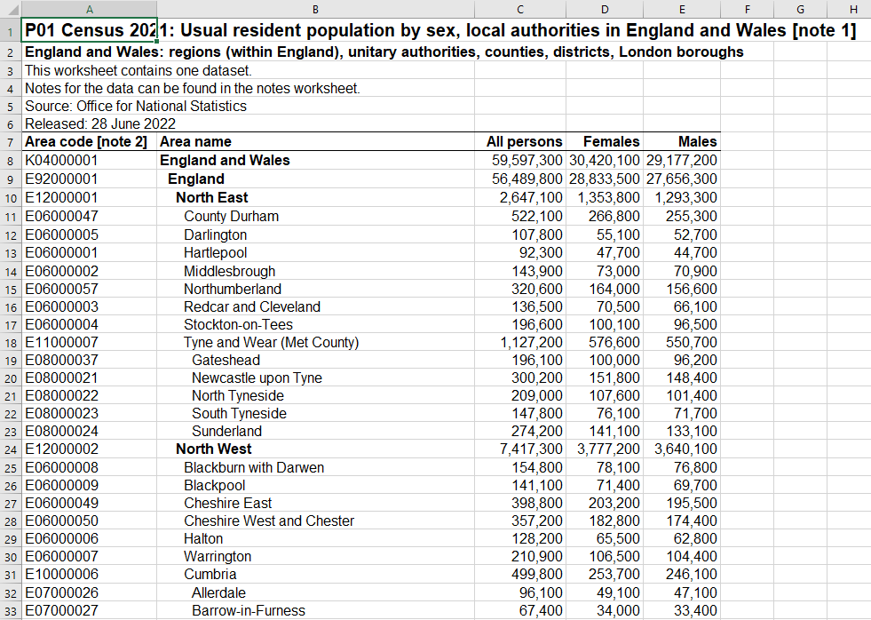

---
output:
  pdf_document: default
  html_document: default
---


<!-- 
This file by Martin Monkman is licensed under a Creative Commons Attribution 4.0 International License. 
-->


```{r setup_ch900, include=FALSE, eval=TRUE}

source("package_load.R")

```


# Extended examples {#examples}


\index{PDF}
\index{Excel}


In this chapter:

* Extracting a data table from a PDF file

* Extracting data that is encoded as formatting in an Excel file


## Data in PDF file


## Excel formatting as data

\index{Excel}

In the "Importing data" chapter, we read the contents of one sheet in an Excel file published by the UK Office of National Statistics, drawn from the 2021 Census of England and Wales ("census2021firstresultsenglandwales1.xlsx"). The file has the population by local authorities (regions), and includes sheets with notes about the data, and data tables containing the population by sex and five-year age groups, along with population density and number of households.


Our focus is on sheet "P01", with population by sex. The first few rows of the data look like this:



One thing to notice about this data is the "Area name" field is hierarchical, with a series of sub-totals. The value "England and Wales" contains the total population, which is the sum of England (Excel's row 8) and Wales (row 360). 

England (but not Wales) is then further subdivided into nine sub-national Regions (coded as "E12" in first three characters of the "Area code" variable). These Regions are then are divided into smaller units, but the description of those units varies. These are Unitary Authorities (E06), London Boroughs (E09), Counties (E10), and Metropolitan Counties (E11); for our purpose, let's shorthand this level as "UA".

The UA level is further divided into Non-Metropolitan Districts (E07), and Metropolitan Counties are subdivided into Metropolitan Districts (E08). The image above shows Tyne and Wear (an E11 Met County, at row 18) is subdivided, starting with Gateshead, while Cumbria (an E10 County, at row 31) is also subdivided, starting with Allerdale.

Wales is divided into Unitary Authorities, coded as "W06" in first three characters of the "Area code" variable. In Wales, there is no intervening Region, so these are at the same level as the Unitary Authorities in England. ^[The hierarchy of the administrative geographies of the UK can be found at the "England" and "Wales" links from this page: https://www.ons.gov.uk/methodology/geography/ukgeographies/administrativegeography]^[You can download a map of these regions at ["Local Authority Districts, Counties and Unitary Authorities (April 2021) Map in United Kingdom"](https://geoportal.statistics.gov.uk/documents/ons::local-authority-districts-counties-and-unitary-authorities-april-2021-map-in-united-kingdom--1/about)] 

This complicated structure means that the data has multiple subtotals—a `sum()` function on the "All persons" variable will lead to a total population of 277,092,700, roughly 4.7 times the actual figure of 59,597,300. What would be much more useful is a structure that has 

* no duplication (people aren't double-counted)

* additional variables (columns), so that each row has the higher level classification. For example, County Durham would have a column that contains the regional value "North East" and the country value of "England".

With that structure, we could use the different regional groupings in a `group_by()` function.

Revisiting the approach we took earlier, the {readxl} function `read_excel()` ignores the formatting, so that there is no way to discern the level in the characters.

```{r}
uk_census_pop <- readxl::read_excel(
  "data/census2021firstresultsenglandwales1.xlsx",
  sheet = "P01",
  range = "A7:E382"
) |> 
  janitor::clean_names() |> 
  dplyr::rename(area_code = area_code_note_2)

uk_census_pop

```

Let's explore approaches to extracting the information that is embedded in the data and the formatting, and use that to prune the duplicated rows.

### Approach 1 - use the Area code

The first approach we can take is to extract the regional element in the "area_code" variable, and use that to filter the data.

For example, if we want to plot the population in England by the UA level, an approach would be to identify all those rows that have an Area code that starts with one of the following:

Unitary Authorities (E06), London Boroughs (E09), Counties (E10), and Metropolitan Counties (E11)

For this, we can design a regular expression that identifies a letter "E" at the beginning (by using the "^" character). This is then followed by either a 0 or a 1 in the 2nd character spot, and in the third spot one of 6, 9, 0, or 1. 

```{r}

ua_pop <- uk_census_pop |> 
  filter(str_detect(area_code, "^E[01][6901]"))


```

We can check to ensure that the regex has worked as intended through the `distinct()` function, examining only the first three characters of the "area_code" strings:

```{r filter_check_ua_900}
  
ua_pop  |>  
  distinct(str_sub(area_code, 1, 3))

```

Another approach would be to create a list of the desired three-character codes, then create a new variable in the main data, and filter against the list:

```{r}
# create list of UA three-character codes
ua_list <- c("E06", "E09", "E10", "E11")

ua_pop <- uk_census_pop |> 
  # create three character area prefix
  mutate(area_code_3 = str_sub(area_code, 1, 3)) |> 
  # filter that by the ua_list
  filter(area_code_3 %in% ua_list)


```

For our validation checks, we will ensure that our list of UAs is complete, and that the calculated total population matches what is given in the "England" row of the source data:

```{r}
# check
ua_pop  |>  
  distinct(area_code_3)

# check
ua_pop  |>  
  summarise(total_pop = sum(all_persons))

```

While this approach works for our particular example, it will require careful coding every time we want to use it. 

### Approach 2 - build a concordance table

A second and more flexible approach we can take is to create a separate concordance table \index{concordance table} (also known as a crosswalk table\index{crosswalk table|see{concordance table}}). Once this table is built, it can be joined that our data, as well as any other table we might need to use in the future.

We will save this table as a CSV file, so it's available quickly for other applications. But we can build it programatically in R, using the {tibble} package. We will use the `tribble()` function, which transposes the layout so it resembles the final tabular structure.

In addition to the name of the category, the level in the hierarchy is also encoded in this table. 

```{r}

uk_region_table <- tribble(
  # header row
  ~"area_code_3", ~"category", ~"geo_level",
  "K04", "England & Wales", 0,
  "E92", "England", 1,
  "E12", "Region", 2,
  "E09", "London Borough", 3,
  "E10", "County",  3,
  "E07", "Non-Metropolitan District", 4,
  "E06", "Unitary Authority", 3,
  "E11", "Metropolitan County", 3,
  "E08", "Metropolitan District", 4,
  "W92", "Wales", 1,
  "W06", "Unitary Authority", 3
)

uk_region_table
```

This table can be saved as a CSV file for future reference:

```{r write_uk_region_table_900, eval=FALSE}

write_csv(uk_region_table, "data_output/uk_region_table.csv")

```


Our next step is to extract the unique values in the area code and area name from the original data file.

```{r}
uk_census_pop_geo <- uk_census_pop |> 
#  select(area_code, area_name) |> 
  mutate(area_code_3 = str_sub(uk_census_pop$area_code, 1, 3)) |> 
  # join with classification table
  left_join(
    uk_region_table,
    by = c("area_code_3" = "area_code_3")
    )

uk_census_pop_geo
```


Because the level was encoded, it is possible to filter on the level to calculate the total population for England and Wales.

```{r}
uk_census_pop_geo |> 
  filter(geo_level == 3) |> 
  summarise(total_population = sum(all_persons))
```


A more complex concordance table would also include the hierarchy:

```{r}

uk_census_geo <- read_csv("data/uk_census_geo.csv")

uk_census_geo

```

This file could also be joined to the contents of a population sheet, to provide additional detail. 

Let's imagine your assignment is to determine which region at the UA level has the highest proportion of people aged 90 or older. The code below reads the contents of sheet "P02" in the census population file, which has age detail of the population in each area. By appending the contents of the concordance table, a detailed disaggregation without double counting is possible.

In addition to changing the sheet reference, the code also changes the range to reflect the differences in the contents.

```{r}
uk_census_pop <- readxl::read_excel(
  "data/census2021firstresultsenglandwales1.xlsx",
  sheet = "P02",
  range = "A8:V383"
) |> 
  janitor::clean_names() |> 
  dplyr::rename(area_code = area_code_note_2) |> 
  # remove "_note_12" from population variables
  dplyr::rename_with(~str_remove(., "_note_12"))

head(uk_census_pop)

```

The `filter()` step below select the area code and the population categories of interest, but this leaves those UA regions that are further disaggregated into the city category. 

```{r}

uk_census_pop |> 
  select(area_code, all_persons, aged_90_years_and_over) |> 
  full_join(uk_census_geo, by = "area_code") |> 
  # filter so that only UAs remain
  filter(!is.na(ua))

```

The solution to our disaggregation challenge is to count the number of rows for the UA regions, and use that as part of a filter. We want to remove the UA rows that have an NA in the city variable while at the same time have two or more rows representing that UA.

This filter requires two tests:

* all of the rows where the number of rows per UA is 1, and 

* for the cases where the number of rows is greater than 1, we want to remove the aggregate, which has an NA in the city variable. For the last test, note that it is wrapped in parenthesis—this isn't always necessary, but it is useful for human readers, and there are instances where the order of operations will matter.

```{r}

uk_census_pop_90 <- uk_census_pop |>
  select(area_code, all_persons, aged_90_years_and_over) |>
  full_join(uk_census_geo, by = "area_code") |>
  # filter so that only UAs remain
  filter(!is.na(ua)) |>
  # count the number of rows of each UA region
  group_by(ua) |>
  mutate(number_of_rows = n()) |>
  ungroup() |>
  # then filter on NA status where number of rows is >1
  filter(number_of_rows == 1 |
           (number_of_rows > 1 & !is.na(city)) # parenthesis!
         )  

```

With this table, the proportion of persons aged 90 or older can be calcutated and the table sorted in descending order:

```{r}

uk_census_pop_90 |> 
  mutate(pct_90_plus = aged_90_years_and_over / all_persons) |> 
  arrange(desc(pct_90_plus)) |> 
  select(area_name, ua, city, aged_90_years_and_over, pct_90_plus) |> 
  slice_head(n = 10) 
  

```


### Approach 3 - use Excel's formatting

_NOT WORKING...YET?_

The leading space we see when we view the Excel file in its native software is not created by space characters, but through Excel's "indent" formatting. There is an R package that has functions that allow us to turn that formatting into information that we can work with. For this, we will be using the packages {tidyxl} [@R-tidyxl] and {unpivotr} [@R-unpivotr].


```{r, eval=FALSE}
library(tidyxl)
library(unpivotr)
```

In the code below, we create an object with the file path as a character string. This has the result of being less typing (and with a name like this, far less risk of a typo), and RStudio can also recognize the object for the autofill feature. The second line of code uses the function `xlsx_sheet_names()` to get the names of all of the sheets in the Excel file. In this case, we are interested in the data in "P01".

```{r}

uk_census_path <- "data/census2021firstresultsenglandwales1.xlsx"

xlsx_sheet_names(
  uk_census_path
  )

```


We already know that Excel files can contain a lot of information that is outside the data rectangle. Rather than ignore all that at the start, we will use the function `tidyxl::xlsx_cells()` to read the entire sheet, using the object with the file path and the `sheets = ` argument to specify what to read. Unlike `readxl::read_excel()`, we won't specify the sheet geometry. This will read the contents of the entire sheet, we will extract the data we want from the object "uk_census" created below. 


```{r}

uk_census <- xlsx_cells(
  uk_census_path,
  sheets = "P01"
  )

# take a quick look
dplyr::glimpse(uk_census)

```

The dataframe created by the `xlsx_cells()` function is nothing like the spreadsheet in the Excel file. Instead, every cell in Excel file is row, and details about that cell are captured. The cell location is captured in the variable "address", while there is also a separate variable for the row number and another for the column number. There is also the value we would see if we were to look at the file, in the variable "character". (If there is a formula in a cell, the function returns the result of the formula in the "character" variable, and the text of the formula in the "formula" variable.)

The "local_format_id" variable is created by {tidyxlr}, and helps us solve the problem of capturing the indentation. This variable contains a unique value for every different type of formatting that is used in the sheet. Below, we look at the first ten rows of the "uk_census" object, and we can see that the value "14" appears repeatedly in the variable "local_format_id".

```{r}
#select(uk_census_col02, row, col, data_type, character, numeric, local_format_id)
uk_census |> 
  slice_head(n = 10) |> 
  select(address, character, local_format_id)

```


The next thing we need to do is read the details of each of the formats stored in the Excel file—the format "14" has particular characteristics, including the number of indentations in the cell. 

For this, we use the {tidyxl} function `xlsx_formats()`. For this, we only need to specify the path to the file. "Excel defines only one of these dictionaries for the whole workbook, so that it records each combination of formats only once. Two cells that have the same formatting, but are in different sheets, will have the same format code, referring to the same entries in that dictionary." ^[Duncan Garmonsway, response to issue #84, {tidyxl} package repository, 2022-05-26. https://github.com/nacnudus/tidyxl/issues/84]

The code below reads the formats, and assigns it to a new object "uk_census_formats".

```{r}

uk_census_formats <- xlsx_formats(
  uk_census_path
)

```

[insert image]

When examining the "uk_census_formats" object, we see that it contains two lists, one called "local" and the other "style". If we look inside "local", we see one called "alignment", and within that is "indent"—this is what we're looking for. We can extract that list-within-a-list, which contains all the indentation specifications of the different cell formats in the file, using the code below:


```{r}

indent <- uk_census_formats$local$alignment$indent

```


Back to the object "uk_census". We are interested in the data starting in the eighth row, so we need to filter for that. 

For the functions to work, we need to have the column that defines the structure in the first position. To accomplish this, we will select it out using the "!=" operator.

The `behead_if()` function is designed to identify a level of headers in a pivot table, and make it part of the data. Similar to the {tidyr} function `pivot_longer()`, it creates a new variable for each row based on the headers. In the case of the UK Census data, the headers are differentiated by the number of indents in the formatting.

Let's test that by assigning the "left-up" position value to a new variable, field0. The 


```{r}
uk_census |> 
  dplyr::filter((row >= 7)) |> 
  filter(col != 1) |> 
  behead_if(indent[local_format_id] == 0, 
            direction = "left-up", 
            name = "field0"
            ) |>
  select(address, row, col, content, field0) |> 
  dplyr::filter(row < 30)

```

Let's continue that through all the levels of indentation—there are four, so we will create a variable that starts with "field" and then has the number of indentations. 

```{r}
uk_census_behead <- uk_census |> 
  dplyr::filter((row >= 7)) |> 
  filter(col != 1) |> 
  behead_if(indent[local_format_id] == 0, direction = "left-up", name = "field0") |> 
  behead_if(indent[local_format_id] == 1, direction = "left-up", name = "field1") |> 
  behead_if(indent[local_format_id] == 2, direction = "left-up", name = "field2") |> 
  behead_if(indent[local_format_id] == 3, direction = "left-up", name = "field3") |> 
  behead_if(indent[local_format_id] == 4, direction = "left-up", name = "field4") 

```

```{r}

uk_census_behead <- uk_census |> 
  dplyr::filter((row >= 7)) |> 
  filter(col != 1) |> 
  behead_if(indent[local_format_id] == 0, direction = "left-up", name = "field0") |> 
  behead_if(indent[local_format_id] == 1, direction = "left-up", name = "field1") |> 
  behead_if(indent[local_format_id] == 2, direction = "left-up", name = "field2") |> 
  behead_if(indent[local_format_id] == 3, direction = "left-up", name = "field3") |> 
  behead_if(indent[local_format_id] == 4, direction = "left", name = "field4") 
#  behead(direction = "left", name = "field4") 


uk_census_behead |> 
  select(field0, field1, field2, field3, field4)

uk_census_behead |> 
#  behead_if(direction = "left-up", name = "field4") |> 
#  dplyr::filter(row < 30) |> 
  select(address, content, field0, field1, field2, field3, field4) |> 
  group_by(field4) |> 
  tally() |> 
  arrange(desc(n))
  
uk_census_behead |> 
  select(address, content, field0, field1, field2, field3, field4) |> 
  filter(field4 == "Sunderland") 
  
  
uk_census_behead |> 
  select(address, content, field0, field1, field2, field3, field4) |> 
  filter(field4 == "Wirral") 

```


Now assign column headers. In this case the structure is not particularly complex, but {tidyr} can also deal with nested hierarchy in the headers as well.

```{r}
# from the prevous chunk:

uk_census_behead <- uk_census |> 
  dplyr::filter((row >= 7)) |> 
  filter(col != 1) |> 
  behead_if(indent[local_format_id] == 0, direction = "left-up", name = "field0") |> 
  behead_if(indent[local_format_id] == 1, direction = "left-up", name = "field1") |> 
  behead_if(indent[local_format_id] == 2, direction = "left-up", name = "field2") |> 
  behead_if(indent[local_format_id] == 3, direction = "left-up", name = "field3") |> 
  behead(direction = "left", name = "field4") |> 
#  now strip (behead) the column names 
  behead(direction = "up", name = "gender") |> 
# add row sorting to preserve visual comparability  
  arrange(row)


```

Did we get the results we expected? Let's do some quick checks of the data, first to see if the 1,125 cells of Excel data (CX to DY) are represented by an individual row (the result of the pivot):

```{r}
nrow(uk_census_behead)
```


We can also look at the first few rows of the variables we are interested in, with a combination of `select()` and `slice_head()`.

```{r}

uk_census_behead |> 
  select(field0:field4, gender, numeric) |> 
  slice_head(n = 10)

```

And the bottom 10 rows, using `slice_tail()`.

```{r}
uk_census_behead |> 
  select(field0:field4, gender, numeric) |> 
  slice_tail(n = 10)

```

A check of the tail of the data (above) reveals a problem with the structure of the Excel file, which (mostly) reflects the nature of the hierarchy. This is not a problem with the {tidyr} and {unpivotr} functions! They are doing things exactly correctly. 

The first thing that catches my eye is that "field2"—the Region—should be NA for Wales, but it has been assigned to the South West, which is the last English Region in the data. 

More problematically, the Welsh Unitary Authorities (W06) should be in "field3", at the same level as the English Unitary Authories (E06), but instead have been assigned to "field4". This has led to Somerset, in England, to be assigned to the Welsh UAs.

Let's take a look at the details of the first row of the Welsh Unitary Authorities. First, in the "uk_census" object, we see that the value of "local_format_id" for the name ("Isle of Anglesey") is 60.

```{r}

uk_census |> 
  dplyr::filter((row == 361)) |> 
  select(address, local_format_id, data_type, character, numeric)

```

We can then use this to examine the details of the indent formatting, which we captured in the "formats" object.

```{r}

formats$local$alignment$indent[60]

```

There are 4 indents. You will recall that the `behead_if()` function was looking left and up. In the case of the Welsh entries, the function has looked up and left until it found an entry that has fewer indents, which happens to be in England, not Wales.

Now we have diagnosed the problem, what solution can we apply? Since our diagnosis of the data is that this problem is consistent and applies only to Wales, a solution is to replace the incorrect assignments as "NA".

In the code below, a new variable "filed2_revised" is created, assigning "NA" to the cases where "field1" is "Wales", and using the existing value of field2 for the remainder. The same approach is then applied to "field3".

```{r}

uk_census_behead_revised <- uk_census_behead |> 
  mutate(field2_revised = case_when(
    field1 == "Wales" ~ NA_character_,
    TRUE ~ field2
  )) |>
  mutate(field3_revised = case_when(
    field1 == "Wales" ~ NA_character_,
    TRUE ~ field3
  )) |>
  select(field0:field2, field2_revised, field3, field3_revised, field4, gender, numeric)
  
uk_census_behead_revised |> 
  tail()

```

Prune the subtotal rows

```{r}

field3_split <- uk_census_behead_revised |> 
  filter(!is.na(field4)) |> 
  distinct(field3_revised)  
  
field3_split

uk_census_behead_revised |> 
  mutate(subtotal_row = case_when(
    field3_revised %in% field3_split$field3_revised & is.na(field4) ~ "subtotal",
    TRUE ~ NA_character_
    ))

```


## Further reading

